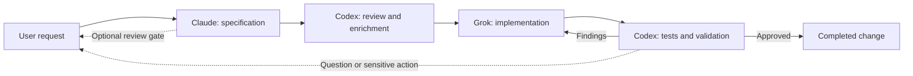
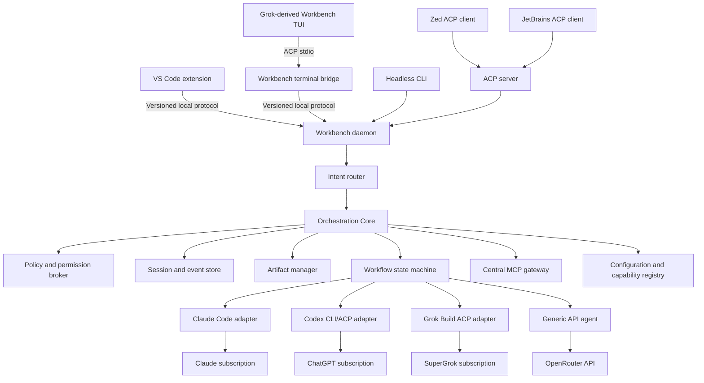

# Multi-Agent Development Workbench


<p align="center">
  
  
  
  
  
  
</p>

<p align="center">
  <a href="README.md"><strong>English</strong></a>
  ·
  <a href="README.pt-BR.md">Português Brasileiro</a>
  ·
  <a href="CONTRIBUTING.md">Contributing</a>
  ·
  <a href="SECURITY.md">Security</a>
  ·
  <a href="LICENSE">License</a>
</p>

<p align="center">
  <strong>One workflow. The right model for every engineering role.</strong>
</p>

> [!IMPORTANT]
> Features **001–016** deliver the monorepo control plane: Rust orchestration
> kernel, encrypted workspace-scoped sessions, headless CLI, thin VS Code
> bridge with real-time workflow controls, supervised Grok/Claude/Codex
> adapters, central MCP lifecycle gateway (including non-loopback HTTPS TLS),
> configurable multi-agent workflows, OpenRouter with cost controls and a
> durable session spend ledger, `workbench agent stdio` (ACP bridge attached to
> the running daemon), fail-closed provider-native write tools under central
> policy, and the `WorkbenchBackend` terminal launch surface. Residual work
> lives outside this monorepo: the full Grok Build pager fork dual-upstream
> rebase and PTY suite remain in
> [grok-build](https://github.com/RenatoTadeuFigueiredo/grok-build).

## Table of Contents

- [Executive Summary](#executive-summary)
- [Proposed Experience](#proposed-experience)
- [Architecture](#architecture)
- [Configuration and Routing](#configuration-and-routing)
- [Project Readiness](#project-readiness)
- [Next Steps](#next-steps)
- [Speckit source of truth](doc/arch/functional/product-overview.md)

🧭 **Current phase:** monorepo control plane complete (Features 001–016).
Active monorepo work is maintenance and operator enablement. Residual product
work is the Grok-derived TUI pager fork in `grok-build` (dual-upstream rebase
and published fork pin).

## Executive Summary

The Multi-Agent Development Workbench is one place to plan, execute, review,
and supervise software work performed by different AI coding agents. The
provider-independent control plane is **delivered in this monorepo** through
Features 001–016: deterministic offline fakes plus supervised adapters for
Grok Build (ACP), Claude Code (stream-JSON), Codex (exec JSONL), and
OpenRouter (Chat Completions) against the same role-oriented contracts, with
central MCP, workflow execution, cost ledgers, and ACP agent stdio for editor
and terminal clients.

The primary interface is **Visual Studio Code**, using its agent sessions,
extension APIs, Git tooling, and native Markdown preview. The thin TypeScript
bridge connects to the provider-independent Rust core and can create, list,
select, attach to, and follow workspace-scoped sessions with real-time
routing, stage, and approval surfaces. `workbench agent stdio` presents
daemon sessions as an ACP agent; the monorepo ships `WorkbenchBackend` as the
launch contract for a Grok-derived pager. The full interactive TUI remains a
fork patch in
[grok-build](https://github.com/RenatoTadeuFigueiredo/grok-build). Optional
ACP compatibility for other editors reuses the same daemon services through
the Workbench ACP server crate.

The goal is not to create another AI model. It is to create a provider-independent control plane that makes multiple existing agents behave like one accountable engineering team.

## At a Glance

| One workspace | Role-based routing | Flexible access | Editor-portable |
|---|---|---|---|
| Prompts, progress, artifacts, diffs, and interventions stay together. | Claude specifies, Codex reviews, Grok implements, and workflows remain configurable. | Use native subscriptions or API models through OpenRouter. | Start in VS Code, continue in the terminal, and connect other editors through ACP. |

**Core principles:** provider independence · explicit handoffs · human control · durable sessions · auditable execution · specification-first delivery.

## Problem

Working with several AI tools currently requires separate windows, sessions, prompts, instruction files, and histories. This creates:

- Inconsistent rules between providers.
- Lost context during manual handoffs.
- Duplicate prompts and repeated repository discovery.
- Concurrent edits and unclear ownership.
- Limited visibility into progress, decisions, and failures.
- No reliable loop between specification, implementation, and validation.

## Proposed Experience

The user starts one session, describes the desired outcome, and selects or reuses a workflow. The orchestrator assigns each stage to the configured agent, streams progress into a unified timeline, persists artifacts, and moves work forward automatically.



The user can interrupt, comment, pause, resume, or redirect the workflow at any time. Human approval gates are configurable by workflow; uncertainty, conflicting requirements, and sensitive operations always stop for confirmation.

## Interfaces

### VS Code Workbench

VS Code is the primary daily workspace:

- Built-in Chat and Agents surfaces for prompts, status, sessions, and interventions.
- Custom agents, subagents, and handoffs for role-oriented interactive work.
- Native Markdown preview with Mermaid rendering.
- Integrated source, Git, diffs, tests, debugging, and terminals.
- Optional isolated Git worktrees for concurrent tasks.

The implemented Workbench bridge uses stable public extension APIs and the
versioned local protocol for workspace endpoint resolution, session creation
and selection, attachment, reconnection, controls, and an in-memory Markdown
event document. Feature 009 surfaces routing plans, workflow stages, and
approvals in that document and status bar. Workflow and provider logic remain
in Rust.

Specifications will be stored as normal repository files, for example:

```text
doc/arch/
├── sdd/001-feature-name/
│   ├── spec.md
│   ├── plan.md
│   └── tasks.md
├── adr/
├── schemas/
└── specs/features/
```

Reviewers can edit the documents directly or add visible review blocks:

```markdown
> [!REVIEW]
> Clarify the behavior when token rotation fails after the old token expires.
```

### Terminal Interface

The terminal path reuses the mature Grok Build pager for prompt editing,
scrollback, Markdown and Mermaid, diffs, approvals, tasks, mouse support, and
terminal behavior. Presentation lives in the
[Workbench Grok Build fork](https://github.com/RenatoTadeuFigueiredo/grok-build);
this monorepo ships the ACP launch surface and daemon bridge:

```bash
workbench daemon
workbench agent stdio
workbench status
workbench session create
workbench session attach <session-id>
workbench session pause <session-id>
workbench session resume <session-id>
workbench session cancel <session-id>
```

The terminal binary is a presentation client, not the orchestrator. It
launches `workbench agent stdio` (Features 011–012), which attaches to the
running workspace daemon and translates ACP into the versioned local protocol.
`WorkbenchBackend` (Feature 016) plans that launch with absolute paths. The
official `grok` executable remains a separate provider runtime for
SuperGrok-backed work. Headless CLI and structured JSON already support
scripts and CI; the full interactive pager dual-upstream rebase remains in
`grok-build`.

## Architecture



All orchestration and application logic, plus every first-party binary, is
implemented in Rust as a small set of independently testable components. The
thin VS Code client is the only first-party runtime exception:

- **Workflow engine:** deterministic stages, transitions, policy-gated retries,
  and review loops.
- **Intent router:** explicit targets, contextual routing, deterministic queries,
  and coordinator-assisted classification without implicit broadcasts.
- **Configuration registry:** layered configuration, stable role and model
  aliases, capability preflight, lock data, and session snapshots.
- **Provider adapters:** process lifecycle, authentication detection, session resume, cancellation, and normalized events.
- **Policy broker:** shared instructions, tool permissions, and approval rules.
- **Event store:** encrypted durable session history and audit trail, initially
  backed by SQLite.
- **Artifact manager:** specifications, plans, decisions, diffs, and validation reports.
- **Editor bridge:** versioned local protocol between the VS Code extension and Rust daemon.
- **VS Code extension:** thin presentation and command adapter with no orchestration logic.
- **ACP server:** compatibility with Zed, JetBrains, and other ACP clients.
- **Terminal ACP bridge:** presents daemon sessions as a capability-negotiated
  ACP agent to the fork-derived pager.
- **Grok-derived terminal client:** reuses upstream presentation behavior
  without owning workflows, provider credentials, or policy.
- **MCP gateway:** installs, versions, supervises, filters, and audits shared
  MCP servers for every compatible provider.
- **Headless CLI:** portable scripted and CI access to the same core.
- **Generic agent runtime:** tool calling, context management, streaming, cost limits, and approval gates for API-backed models.

## Rust Implementation

The current implementation is a pinned Rust 1.95 Cargo workspace:

```text
crates/
├── workbench-core/              # Domain model, routing, policy, and ports
├── workbench-config/            # Layers, validation, snapshots, and locks
├── workbench-storage/           # Encrypted SQLite, key stores, export, spend
├── workbench-protocol/          # Strict versioned NDJSON commands and events
├── workbench-daemon/            # Application services and same-user Unix IPC
├── workbench-cli/               # Daemon lifecycle and headless client commands
├── workbench-acp/               # Bounded ACP v1 provider client and supervision
├── workbench-acp-server/        # ACP agent stdio bridge to the local protocol
├── workbench-claude/            # Claude stream-JSON and per-attempt supervision
├── workbench-codex/             # Codex exec JSONL and per-attempt supervision
├── workbench-openrouter/        # OpenRouter Chat Completions and cost budgets
├── workbench-mcp/               # Central MCP gateway, pins, TLS, allowlists
├── workbench-terminal-backend/  # WorkbenchBackend launch contract for the TUI
└── workbench-testkit/           # Deterministic fakes, contracts, acceptance, SLOs
```

Build and exercise the offline vertical slice:

```bash
make build
# optional: copy examples/workbench.yaml.example → .workbench/workbench.yaml
# and set absolute, versioned provider executable paths (never PATH symlinks)
cargo run -p workbench-cli -- config lock
cargo run -p workbench-cli -- config validate
cargo run -p workbench-cli -- daemon
# in another terminal:
cargo run -p workbench-cli -- --json status
cargo run -p workbench-cli -- --json session create
```

See the
[operator E2E quickstart](docs/operations/operator-e2e-quickstart.md) for
lock, daemon, session, workflow, VS Code attach, agent stdio, and cost-policy
paths (offline vs live). Feature-specific runbooks cover
[Grok ACP](docs/operations/grok-acp-provider.md),
[Claude Code](docs/operations/claude-code-provider.md),
[Codex](docs/operations/codex-provider.md), and
[OpenRouter](docs/operations/openrouter-provider.md). The
[local operations guide](doc/arch/operations/operations.md) covers runtime
layout, MCP gateway, recovery, and backup.

The VS Code extension is the only first-party component outside Rust because
VS Code extensions run in a TypeScript/JavaScript host. It remains a
replaceable client that renders daemon state and forwards commands. The
repository's bounded JSON-RPC/NDJSON ACP implementation is isolated in
`workbench-acp`, so protocol and provider changes do not leak into the domain
model.

The terminal presentation source is maintained separately in the Grok Build
fork. Its `main` branch mirrors upstream exactly; the `workbench` branch carries
the minimal external-backend patch stack. The main Workbench repository pins a
tested fork commit rather than vendoring the pager.

## Configuration and Routing

Providers, model aliases, roles, routing, policies, and workflows will be
declarative. Workflows target stable roles rather than vendor-specific models:

```yaml
version: 1

providers:
  claude:
    type: subscription-cli
    driver: claude-code
    executable: /absolute/canonical/path/to/versioned/claude
  grok:
    type: acp
    executable: /absolute/canonical/path/to/grok

models:
  specification:
    provider: claude
    runtime_model: fable
  implementation:
    provider: grok
    runtime_model: grok-4.5
  review-fallback:
    provider: grok
    runtime_model: grok-4.5

roles:
  workspace-coordinator:
    model: review-fallback
  product-architect:
    model: specification
  critical-reviewer:
    model: review-fallback
  implementer:
    model: implementation
  code-reviewer:
    model: review-fallback

routing:
  default_role: workspace-coordinator
  confidence_threshold: 0.85

policies:
  default_tool_mode: read-only
  global_deny: []
  production_mutations: approval-required

workflows:
  feature-delivery:
    steps:
      - id: specification
        role: product-architect
      - id: spec-review
        role: critical-reviewer
      - id: implementation
        role: implementer
      - id: validation
        role: code-reviewer
        on_findings: implementation
        max_iterations: 3
```

This is a repository-layer example. Safe built-ins supply omitted empty role
fields; tools and data sources must be declared before a role can reference
them. The resolved configuration is fully explicit and must satisfy the
committed schema. Claude, Codex, Grok, and OpenRouter drivers ship in this
monorepo; only declare a provider when its executable or credential path is
installed and authenticated for that workstation.

Configuration resolves from built-in safe defaults, user configuration,
`.workbench/workbench.yaml`, and explicit session overrides. A
deterministic `.workbench/workbench.lock` pins the non-session adapter, model,
MCP, and compatibility data. Session overrides create a linked session lock
without rewriting that base file. Secrets remain in the system keychain and
sensitive session payloads are encrypted with per-session keys.

Every free-form message reaches the daemon first. Explicit targets and active
workflow context take precedence, followed by deterministic status/history
resolvers and the configured coordinator. Before dispatch, the UI shows the
intent, role, resolved model, tools, data sources, permissions, and confidence.
Messages are never broadcast to multiple providers implicitly.

All providers implement a shared capability contract. Adding a model to an
existing adapter or compatible API is configuration-only; a new protocol
requires an isolated Rust adapter. Removing a provider validates affected
aliases and fallbacks without making historical sessions unreadable. Active
sessions retain a redacted configuration snapshot, so model changes affect new
sessions unless explicitly migrated.

Capability preflight distinguishes chat-only models from coding agents by
checking tool calling, structured output, context size, privacy, availability,
cost limits, resume support, and protocol compatibility. The full decision is
documented in
[`docs/architecture/configuration-routing-and-providers.md`](docs/architecture/configuration-routing-and-providers.md).

## Shared Rules and Context

The orchestrator will resolve a canonical instruction set for every stage:

1. Organization policies.
2. Repository `AGENTS.md`.
3. Provider-compatible repository instructions such as `CLAUDE.md`.
4. Workflow and role instructions.
5. The current user request.

The resolved instructions will be visible before execution and injected into every handoff. Provider-native configuration will remain supported, but conflicts will be reported instead of silently choosing one rule.

## Shared MCP and Tools

The daemon will own a canonical MCP manifest and lockfile. Installing or
updating a shared server once will pin its package or image version, checksum,
transport, credential reference, and policy. Compatible agents connect to a
single Workbench MCP gateway and receive role-specific tool allowlists.

Remote HTTP MCP servers naturally share one endpoint. Local stdio servers are
started and supervised by the gateway so provider clients do not independently
download or launch different versions. Credentials remain in the system
keychain or environment and are never written to the manifest.

Provider-native tools such as each agent's built-in file editor, shell, or
patch mechanism remain provider-specific. Capabilities that must behave
identically across Claude, Codex, Grok, and OpenRouter agents will be exposed as
Workbench-managed MCP tools. The gateway records calls, applies approval
policy, redacts secrets, and isolates sessions.

## Authentication and Billing

Native agents will use existing subscriptions; OpenRouter will be an explicit API-backed option:

| Agent or provider | Authentication path | Billing |
|---|---|---|
| Claude | Official Claude Code login | Provider-controlled; current `claude -p`, Agent SDK, and third-party app use draws from subscription limits |
| Codex | Codex login with ChatGPT | ChatGPT Pro |
| Grok | Grok Build browser/device login | SuperGrok Heavy |
| OpenRouter | API key stored in the system keychain | OpenRouter credits, billed per use |

Credentials remain owned by provider CLIs or the operating-system keychain and
must not be copied into workflow files or the session database. Anthropic
controls Claude subscription eligibility and billing; Workbench neither offers
Claude login nor promises that a plan covers programmatic use. The UI will
distinguish subscription routes from API usage and report OpenRouter token
consumption and cost per stage. Anthropic paused its announced separate Agent
SDK credit on June 15, 2026; operators must review the
[current plan guidance](https://support.claude.com/en/articles/15036540-use-the-claude-agent-sdk-with-your-claude-plan)
before use.

The Grok-derived Workbench terminal does not reuse or access the Grok
subscription credential store. Only the unmodified official `grok` provider
process authenticates to SuperGrok.

VS Code's built-in third-party agent sessions and the providers' official extensions are different billing paths. The Workbench will default to the official Claude Code, Codex, and Grok Build authentication flows so an existing provider subscription is not silently replaced by GitHub Copilot billing. Copilot-backed sessions and VS Code BYOK models may still be used when explicitly selected.

## Editor Portability

VS Code is the first frontend, not the product foundation. Workflows, sessions, provider adapters, rules, and artifacts belong to the Rust core and remain usable without an editor.

- **VS Code:** uses the first-party extension and local editor bridge exposed by `workbench daemon`.
- **Terminal:** uses the Grok-derived Workbench pager through
  `workbench agent stdio`, with no editor dependency.
- **CI and scripts:** use the headless CLI and structured event output.
- **Zed:** connects to the optional `workbench serve-acp` compatibility endpoint.
- **JetBrains:** uses its ACP client and the same compatibility endpoint.

Editor-specific features such as diff presentation, panels, worktrees, and permission dialogs may look different. Capability negotiation will provide safe degradation, while Markdown artifacts and the event log remain the portable source of truth. No workflow, provider, credential, or policy logic may be implemented inside the VS Code extension.

## Safety and Change Control

- Only one workflow stage writes to a working tree at a time by default.
- Read-only reviewers cannot modify files unless the workflow grants permission.
- Commands, edits, approvals, and handoffs are recorded as events.
- Destructive filesystem actions, external publishing, and production mutations require explicit approval.
- Secrets are redacted from logs and never stored in artifacts.
- Cancellation propagates to provider processes without losing the resumable session.

## Performance Strategy

VS Code has a higher baseline resource cost than a native editor, but it removes the need to build an editor, agent-session shell, Git client, debugger, test UI, and Markdown renderer. The extension will activate lazily, reuse native VS Code UI where practical, and avoid a permanent webview process. The Rust daemon and provider processes will start on demand and remain persistent only while useful.

Concurrency limits, bounded event buffers, incremental artifact updates, and process health checks will prevent inactive agents from consuming resources indefinitely. Performance acceptance tests will measure extension activation, idle memory, event-stream responsiveness, and the complete multi-agent workflow rather than editor startup alone.

The terminal path avoids recreating a mature terminal framework. It reuses the
Grok pager's input, rendering, scrollback, and PTY behavior while keeping the
daemon and providers in separate processes. Terminal performance tests will
cover startup, memory, high-volume streaming, cancellation latency, and
reconnection.

## Open-Source Strategy

The orchestration engine will remain independent from any editor or model provider. A versioned local protocol is the primary boundary for the VS Code client, while ACP remains an interoperability boundary for compatible editors and agents. Both terminate at adapters around the same Rust application services.

The VS Code extension will use stable public extension APIs and remain independently replaceable. The MVP will not depend on private or proposed VS Code APIs for core workflow behavior.

[Grok Build](https://github.com/xai-org/grok-build) is Apache-2.0 licensed and
provides the terminal pager used as the Workbench TUI foundation. The
[Workbench fork](https://github.com/RenatoTadeuFigueiredo/grok-build) follows an
upstream-first patch-stack model:

- `main` is a fast-forward-only mirror of `xai-org/grok-build:main`;
- `workbench` contains a small, reviewed external ACP backend;
- product branches start from and target `workbench`;
- upstream updates are rebased on a temporary sync branch, reviewed with
  `git range-diff`, and never auto-merged; and
- release tags and tested upstream commits remain immutable.

The patch must preserve the original Grok backend and reuse its action, effect,
rendering, scrollback, permission, task, and testing architecture. Workflow
logic is not allowed in the fork. The complete decision, patch limits,
compatibility gates, and rollback policy are documented in
[`docs/architecture/grok-build-terminal-integration.md`](docs/architecture/grok-build-terminal-integration.md).

Feature 004 implements the required ACP v1 client subset as a small bounded
JSON-RPC/NDJSON adapter. Features 011–012 deliver `workbench agent stdio` via
`workbench-acp-server`. OpenRouter is integrated through its HTTP API from
Rust (`workbench-openrouter`) with local cost budgets and a durable session
spend ledger—never as an agent runtime inside the VS Code extension. The
[ACP Rust SDK](https://github.com/agentclientprotocol/rust-sdk) remains a
candidate for broader ACP server surfaces subject to compatibility and
supply-chain review.

This repository is licensed under the [Apache License 2.0](LICENSE). Reused or modified third-party components must retain their required copyright, license, and notice files.

## MVP Scope

The monorepo MVP (Features 001–016) includes:

1. Claude, Codex, and Grok process adapters using provider-owned authentication.
2. OpenRouter Chat Completions adapter with capability and cost controls plus a
   durable session spend ledger.
3. Configurable multi-agent workflows (specification, review, implementation,
   validation loops).
4. Encrypted persistent sessions with pause, resume, cancel, and
   human-controlled reconciliation after uncertain outcomes.
5. A thin VS Code extension for prompts, workflow progress, artifacts,
   approvals, routing/stage surfaces, and session control.
6. `workbench agent stdio` ACP bridge attached to the running daemon, headless
   JSON CLI, and `WorkbenchBackend` launch contract for the Grok-derived TUI.
7. Markdown artifacts, Mermaid diagrams, and configurable review gates.
8. Central instruction resolution, MCP lifecycle (stdio and non-loopback
   HTTPS), tool permissions, provider-native writes under policy, and
   approval policies.
9. Layered configuration, explainable intent routing, model aliases, provider
   capability discovery, and safe provider removal.
10. Automated adapter, workflow, acceptance-binding inventory, recovery, and
    offline end-to-end harnesses.

Residual outside this monorepo: full Grok pager dual-upstream rebase automation
and expanded PTY snapshot suite in `grok-build`. The fork compatibility pin
(`GROK_BUILD_FORK_COMPATIBILITY_PIN`) is published for the WorkbenchBackend
integration commit. Mode C operator path (Grok TUI → `workbench agent stdio` →
daemon):
[docs/operations/mode-c-grok-tui-workbench.md](docs/operations/mode-c-grok-tui-workbench.md).
Parallel feature branches, remote workers, a visual workflow designer, team
collaboration, analytics, deeper VS Code Agents integration, and additional
editor-specific extensions remain follow-up product roadmap items.

## Current Validation

- The multi-crate Rust workspace builds a same-user daemon and headless CLI
  with encrypted workspace isolation, deterministic fake execution, supervised
  provider adapters (Grok ACP, Claude, Codex, OpenRouter), central MCP,
  workflow execution, and ACP agent stdio.
- Sensitive session payloads are encrypted in SQLite; root keys use macOS
  Keychain or Linux Secret Service; exports use age encryption; Feature 014
  adds a durable per-session spend ledger for cost policy.
- Features 001–016 ship offline acceptance harnesses under
  `workbench-testkit` (`make test-acceptance`). Repository-owned feature↔harness
  inventory is gated by `make test-acceptance-bindings` (issue #28).
- Speckit `verifyHealth` stays 0 because Speckit's executable registry is
  binary-local (ADR-0020) and cannot load external Rust runners; authoritative
  offline gates remain the repository harnesses above.
- Default CI is offline and quota-free. Live provider smokes (Grok, Claude,
  Codex, OpenRouter) and real Keychain/Secret Service coverage are opt-in /
  ignored (`make test-platform` for credential stores).
- Production Grok path launches `grok agent --no-leader stdio`, disables
  auto-update, pins digest, negotiates ACP v1, and keeps credentials outside
  Workbench. Claude/Codex provider-native writes require
  `policies.provider_native_writes` allowlist + approval-required mode
  (Feature 015; default disabled).
- The thin VS Code bridge creates, lists, selects, attaches, and follows
  sessions for its resolved workspace endpoint, including workflow routing and
  approval surfaces (Feature 009).
- `WorkbenchBackend` plans `workbench agent stdio` with absolute paths
  (Feature 016). `GROK_BUILD_FORK_COMPATIBILITY_PIN` is published; full pager
  dual-upstream rebase automation and expanded PTY suite remain in
  `grok-build`. Mode C:
  [mode-c-grok-tui-workbench.md](docs/operations/mode-c-grok-tui-workbench.md).
- Durable delivery evidence and issue/PR mapping live in
  [`docs/project/STATUS.md`](docs/project/STATUS.md).

## Success Criteria

The MVP is successful when a user can submit one feature request and:

- Follow every stage from a single VS Code Workbench conversation or terminal session.
- Inspect and comment on rendered specifications before or during execution.
- Automatically complete at least one implementation-review-fix loop.
- Apply the same repository rules to native and API-backed agents.
- Resume safely after an editor restart or provider failure.
- Distinguish subscription consumption from OpenRouter API cost for every stage.
- Open the same persisted session from VS Code and the terminal interface.
- Replace a role's model without changing its workflow, and explain every
  automatic routing decision before execution.
- Review a complete audit trail of prompts, decisions, commands, edits, and results.

## Project Readiness

| Foundation | Status | Owner |
|---|---|---|
| Product vision, architecture, and MVP boundary | Ready | This README |
| Public licensing and third-party notice policy | Ready | `LICENSE` and `NOTICE` |
| Contribution and vulnerability reporting policies | Ready | `CONTRIBUTING.md` and `SECURITY.md` |
| Shared repository instructions | Ready | `AGENTS.md` |
| Encoding, line endings, and GitHub collaboration templates | Ready | Repository configuration |
| Grok Build terminal integration decision and update policy | Ready | `docs/architecture/grok-build-terminal-integration.md` |
| Configuration, routing, and provider modularity decision | Ready | `docs/architecture/configuration-routing-and-providers.md` |
| Speckit scaffold, constitution, and governance baseline | Ready | `doc/arch/` |
| Orchestration kernel, encrypted sessions, protocol, and CLI | Delivered | Feature 001 |
| Thin VS Code session bridge and workflow controls | Delivered | Features 002, 003, 009 |
| Supervised Grok Build ACP provider | Delivered | Feature 004 |
| Supervised Claude Code provider (+ policy-gated native writes) | Delivered | Features 005, 015 |
| Supervised Codex provider (+ policy-gated native writes) | Delivered | Features 006, 015 |
| Central MCP gateway (stdio + non-loopback HTTPS TLS) | Delivered | Features 007, 013 |
| Configurable multi-agent workflow executor | Delivered | Feature 008 |
| OpenRouter API provider, cost controls, spend ledger | Delivered | Features 010, 014 |
| Workbench ACP agent stdio (MVP + daemon attach) | Delivered | Features 011, 012 |
| WorkbenchBackend terminal launch surface | Delivered | Feature 016 |
| Cargo workspace and deterministic acceptance harnesses | Delivered | Rust crates + `workbench-testkit` |
| Operator E2E quickstart | Delivered | `docs/operations/operator-e2e-quickstart.md` |
| Mode C Grok TUI → Workbench bridge | Delivered (docs + pin) | `docs/operations/mode-c-grok-tui-workbench.md` |
| Full Grok pager dual-upstream rebase automation and PTY suite | Residual (out of tree) | [grok-build](https://github.com/RenatoTadeuFigueiredo/grok-build) |

The workspace pins Rust 1.95.0 and direct dependencies. The default
`make check` gate is deterministic and offline; real Keychain/Secret Service
coverage runs through the explicit `make test-platform` gate on macOS and
Linux. Monorepo Known Gaps are empty; see
[`docs/project/STATUS.md`](docs/project/STATUS.md).

## Specification-First Delivery

This README defines the product vision; `doc/arch/` defines implementation
requirements. Features 001–016 completed the Speckit workflow through
`implement` for the monorepo control plane:

```text
specify → clarify → plan → tasks → analyze → implement
```

Each phase produces reviewable Markdown artifacts, and `speckit validate` must
pass before a corpus or implementation commit. Future behavior changes require
a tracked change and a new or active Speckit feature before product code.

## Next Steps

Run `make context` in a fresh session and use
[`docs/project/STATUS.md`](docs/project/STATUS.md) as the durable handoff.

1. **Operate the monorepo control plane** with the
   [operator E2E quickstart](docs/operations/operator-e2e-quickstart.md)
   (config lock, daemon, session, workflow, VS Code attach, agent stdio, cost
   policy; offline vs live).
2. **Mode C (combined):** run the Grok TUI as an ACP client of
   `workbench agent stdio` —
   [mode-c-grok-tui-workbench.md](docs/operations/mode-c-grok-tui-workbench.md)
   (env vars, same-session VS Code + TUI, fail-closed troubleshooting).
3. **Residual product work (out of tree):** complete Grok Build dual-upstream
   rebase automation and expanded PTY suite in
   [grok-build](https://github.com/RenatoTadeuFigueiredo/grok-build)
   (consumes monorepo `WorkbenchBackend` / pin).
4. **Monorepo maintenance:** new roadmap items only—no open gap-zero backlog
   issues in this repository.

## References

- [VS Code Agents](https://code.visualstudio.com/docs/agents/overview)
- [VS Code Custom Agents and Handoffs](https://code.visualstudio.com/docs/agent-customization/custom-agents)
- [VS Code Subagents](https://code.visualstudio.com/docs/agents/subagents)
- [VS Code Third-Party Agents](https://code.visualstudio.com/docs/agents/agent-types/third-party-agents)
- [VS Code Chat Participant API](https://code.visualstudio.com/api/extension-guides/ai/chat)
- [VS Code Language Models and BYOK](https://code.visualstudio.com/docs/agent-customization/language-models)
- [VS Code Markdown and Mermaid](https://code.visualstudio.com/docs/languages/markdown)
- [Agent Client Protocol](https://agentclientprotocol.com/)
- [ACP Rust SDK](https://github.com/agentclientprotocol/rust-sdk)
- [Grok Build documentation](https://docs.x.ai/build/overview)
- [Grok Build source](https://github.com/xai-org/grok-build)
- [Workbench Grok Build fork](https://github.com/RenatoTadeuFigueiredo/grok-build)
- [Grok Build terminal integration decision](docs/architecture/grok-build-terminal-integration.md)
- [Configuration, routing, and provider modularity decision](docs/architecture/configuration-routing-and-providers.md)
- [OpenRouter API](https://openrouter.ai/docs/quickstart)
- [Operator E2E quickstart](docs/operations/operator-e2e-quickstart.md)
- [Mode C Grok TUI → Workbench](docs/operations/mode-c-grok-tui-workbench.md)
- [Project status](docs/project/STATUS.md)
- [Claude Code for VS Code](https://code.claude.com/docs/en/ide-integrations)
- [Codex authentication](https://learn.chatgpt.com/docs/auth)
- [Zed External Agents](https://zed.dev/docs/ai/external-agents)
- [JetBrains ACP support](https://blog.jetbrains.com/ai/2026/02/koog-x-acp-connect-an-agent-to-your-ide-and-more/)
