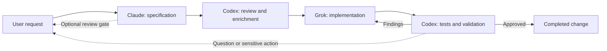
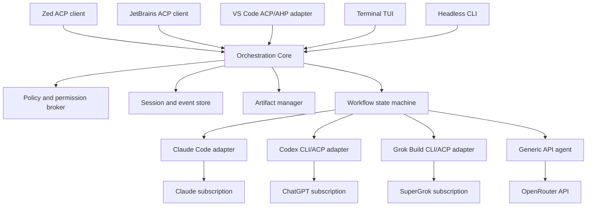

# Multi-Agent Development Workbench

> **Status:** Project proposal and technical discovery. The orchestration product has not yet been implemented.

## Executive Summary

The Multi-Agent Development Workbench will provide one place to plan, execute, review, and supervise software work performed by different AI coding agents. It will coordinate Claude, Codex, Grok, and OpenRouter-backed models according to explicit roles. Native agents will preserve the subscriptions and authentication already used with each provider, while OpenRouter will provide optional pay-per-use access to a broader model catalog.

The primary interface will be **Zed**, selected for its native performance, Markdown and Mermaid support, parallel agent experience, and Agent Client Protocol (ACP) integration. The same orchestration engine will also expose a lightweight terminal interface for remote work, automation, and environments where a graphical editor is unnecessary.

The goal is not to create another AI model. It is to create a provider-independent control plane that makes multiple existing agents behave like one accountable engineering team.

## Problem

Working with several AI tools currently requires separate windows, sessions, prompts, instruction files, and histories. This creates:

- Inconsistent rules between providers.
- Lost context during manual handoffs.
- Duplicate prompts and repeated repository discovery.
- Concurrent edits and unclear ownership.
- Limited visibility into progress, decisions, and failures.
- No reliable loop between specification, implementation, and validation.

## Proposed Experience

The user starts one session, describes the desired outcome, and selects or reuses a workflow. The orchestrator assigns each stage to the configured agent, streams progress into a unified timeline, persists artifacts, and moves work forward automatically.



The user can interrupt, comment, pause, resume, or redirect the workflow at any time. Human approval gates are configurable by workflow; uncertainty, conflicting requirements, and sensitive operations always stop for confirmation.

## Interfaces

### Zed Workbench

Zed is the primary daily workspace:

- One project view for source, Git, terminals, and agent threads.
- Unified conversation for prompts, status, results, and interventions.
- Native Markdown preview with Mermaid rendering.
- Inline review of generated diffs and specification artifacts.
- Optional isolated Git worktrees for concurrent tasks.

Specifications will be stored as normal repository files, for example:

```text
docs/specs/auth-token-rotation/
├── spec.md
├── plan.md
├── decisions.md
└── validation.md
```

Reviewers can edit the documents directly or add visible review blocks:

```markdown
> [!REVIEW]
> Clarify the behavior when token rotation fails after the old token expires.
```

### Terminal Interface

The terminal application will expose the same sessions, workflows, and policies:

```bash
workbench start workflows/feature.yaml
workbench status
workbench attach <session-id>
workbench pause
workbench resume
workbench serve-acp
```

Interactive TUI and structured streaming output will support local terminals, SSH, scripts, and CI jobs.

## Architecture



All application logic and first-party binaries will be implemented in Rust as a small set of independently testable components:

- **Workflow engine:** deterministic stages, transitions, retries, and review loops.
- **Provider adapters:** process lifecycle, authentication detection, session resume, cancellation, and normalized events.
- **Policy broker:** shared instructions, tool permissions, and approval rules.
- **Event store:** durable session history and audit trail, initially backed by SQLite.
- **Artifact manager:** specifications, plans, decisions, diffs, and validation reports.
- **ACP server:** integration with Zed and other compatible editors.
- **TUI/CLI:** portable access to the same core without duplicating behavior.
- **Generic agent runtime:** tool calling, context management, streaming, cost limits, and approval gates for API-backed models.

## Rust Implementation

The project will be a Cargo workspace that produces one portable `workbench` binary:

```text
crates/
├── workbench-core/          # Workflows and domain model
├── workbench-agent/         # Generic agent loop and tools
├── workbench-acp/           # ACP client and server
├── workbench-providers/     # Claude, Codex, and Grok adapters
├── workbench-openrouter/    # OpenRouter API adapter
├── workbench-storage/       # SQLite and artifacts
├── workbench-policy/        # Rules, permissions, and approvals
├── workbench-tui/           # Terminal interface
├── workbench-cli/           # Commands and headless execution
└── workbench-testkit/       # Fake agents and integration fixtures
```

The same executable will support interactive, headless, editor, and background modes:

```bash
workbench                         # Open the terminal UI
workbench run workflow.yaml       # Execute headlessly
workbench serve-acp               # Connect Zed or JetBrains
workbench daemon                  # Keep sessions running
workbench status                  # Inspect active sessions
```

The official Rust ACP SDK will be isolated behind `workbench-acp` so protocol changes do not leak into the domain model. Provider CLIs and editors remain external processes; a future VS Code-specific extension may require a thin TypeScript adapter, but it will not contain orchestration logic.

## Workflow Configuration

Workflows will be declarative and version-controlled:

```yaml
name: feature-delivery

providers:
  openrouter:
    type: api
    api_key: keychain:openrouter
    privacy:
      zero_data_retention: true
      data_collection: deny

steps:
  - id: specification
    role: product-architect
    agent: claude
    model: fable-5
    writes: ["docs/specs/**"]

  - id: spec-review
    role: critical-reviewer
    agent: codex
    model: gpt-5.6-sol
    reads: ["docs/specs/**"]
    fallback:
      agent: grok
      model: grok-4.5

  - id: implementation
    role: implementer
    agent: grok
    model: grok-4.5

  - id: validation
    role: code-reviewer
    agent: codex
    model: gpt-5.6-sol
    on_findings: implementation
    max_iterations: 3
```

Model identifiers, agent roles, concurrency, approval gates, timeouts, and fallback behavior will remain configurable rather than embedded in application code.

OpenRouter models will pass a capability preflight before assignment. The Workbench will distinguish chat-only models from models suitable for coding-agent work by checking tool calling, structured output, context size, privacy policy, availability, and configured cost limits.

## Shared Rules and Context

The orchestrator will resolve a canonical instruction set for every stage:

1. Organization policies.
2. Repository `AGENTS.md`.
3. Provider-compatible repository instructions such as `CLAUDE.md`.
4. Workflow and role instructions.
5. The current user request.

The resolved instructions will be visible before execution and injected into every handoff. Provider-native configuration will remain supported, but conflicts will be reported instead of silently choosing one rule.

## Authentication and Billing

Native agents will use existing subscriptions; OpenRouter will be an explicit API-backed option:

| Agent or provider | Authentication path | Billing |
|---|---|---|
| Claude | Official Claude Code login | Claude Max |
| Codex | Codex login with ChatGPT | ChatGPT Pro |
| Grok | Grok Build browser/device login | SuperGrok Heavy |
| OpenRouter | API key stored in the system keychain | OpenRouter credits, billed per use |

Credentials remain owned by provider CLIs or the operating-system keychain and must not be copied into workflow files or the session database. The UI will clearly distinguish subscription usage from API usage and report OpenRouter token consumption and cost per stage.

## Editor Portability

Zed is the first frontend, not the product foundation. Workflows, sessions, provider adapters, rules, and artifacts belong to the Rust core and remain usable without an editor.

- **Zed:** connects directly to `workbench serve-acp`.
- **JetBrains:** uses its built-in ACP client and the same server command.
- **VS Code:** uses an ACP client extension or a future thin ACP-to-AHP adapter.
- **Terminal/CI:** uses the TUI or headless CLI with no editor dependency.

Editor-specific features such as diff presentation, panels, worktrees, and permission dialogs may look different. Capability negotiation will provide safe degradation, while Markdown artifacts and the event log remain the portable source of truth. No workflow or provider logic may be implemented inside a Zed extension.

## Safety and Change Control

- Only one workflow stage writes to a working tree at a time by default.
- Read-only reviewers cannot modify files unless the workflow grants permission.
- Commands, edits, approvals, and handoffs are recorded as events.
- Destructive filesystem actions, external publishing, and production mutations require explicit approval.
- Secrets are redacted from logs and never stored in artifacts.
- Cancellation propagates to provider processes without losing the resumable session.

## Performance Strategy

Zed avoids the baseline cost of an Electron-based IDE, while the Rust orchestration core minimizes additional runtime overhead. Provider processes will start lazily and remain persistent only while useful. Concurrency limits, bounded event buffers, incremental artifact updates, and process health checks will prevent inactive agents from consuming resources indefinitely.

The editor is only part of the total cost: model CLIs, language servers, tests, containers, and build tools remain separate processes. Performance acceptance tests will therefore measure the complete workflow rather than editor startup alone.

## Open-Source Strategy

The orchestration engine will remain independent from any editor or model provider. ACP is the integration boundary, allowing additional clients and agents without rewriting the workflow engine.

[Grok Build](https://github.com/xai-org/grok-build) is Apache-2.0 licensed and provides useful reference implementations for a Rust TUI, headless execution, sessions, tools, and ACP. Components may be reused with the required attribution, but the product should not depend on a deep Grok Build fork because its public repository is periodically synchronized from its upstream monorepo.

The official [ACP Rust SDK](https://github.com/agentclientprotocol/rust-sdk) will provide protocol types, transports, clients, agents, and proxies. OpenRouter will be integrated through its HTTP API directly from Rust rather than introducing a TypeScript agent runtime.

This repository is licensed under the [Apache License 2.0](LICENSE). Reused or modified third-party components must retain their required copyright, license, and notice files.

## MVP Scope

The first usable release will include:

1. Claude, Codex, and Grok process adapters using subscription authentication.
2. A generic Rust agent runtime and OpenRouter adapter with capability and cost controls.
3. Sequential specification, review, implementation, and validation workflows.
4. Persistent sessions with pause, resume, cancel, and retry.
5. Zed integration through one custom ACP agent.
6. Terminal TUI and headless JSON output.
7. Markdown artifacts, Mermaid diagrams, and configurable review gates.
8. Central instruction resolution and permission policies.
9. Automated adapter, workflow, recovery, and end-to-end tests.

Parallel feature branches, remote workers, a workflow designer, team collaboration, analytics, and native editor adapters beyond ACP are follow-up capabilities.

## Current Validation

- Codex headless execution, structured output, and session resume were validated locally.
- Grok headless execution, structured output, session resume, and native ACP were validated locally.
- A Codex-to-Grok implementation and review loop completed successfully; the reviewer detected an edge-case defect, Grok corrected it, and the final validation passed.
- Claude requires local account reauthentication before the full three-provider end-to-end test can be completed.
- OpenRouter integration and model capability preflight remain to be validated in the Rust spike.

## Success Criteria

The MVP is successful when a user can submit one feature request and:

- Follow every stage from a single Zed thread or terminal session.
- Inspect and comment on rendered specifications before or during execution.
- Automatically complete at least one implementation-review-fix loop.
- Apply the same repository rules to native and API-backed agents.
- Resume safely after an editor restart or provider failure.
- Distinguish subscription consumption from OpenRouter API cost for every stage.
- Open the same persisted session from Zed and the terminal interface.
- Review a complete audit trail of prompts, decisions, commands, edits, and results.

## Specification-First Delivery

This README defines the product vision, not implementation requirements. Before product code begins, the repository will be initialized for Speckit and the first active feature will follow the complete specification lifecycle:

```text
specify → clarify → plan → tasks → analyze → implement
```

Each phase will produce reviewable Markdown artifacts, and `speckit validate` must pass before the specification corpus or feature implementation is considered complete. The initial Speckit feature should define the orchestration kernel, protocol boundaries, failure semantics, security model, and acceptance tests before adapter implementation begins.

## Next Steps

1. Approve this vision and the proposed MVP boundary.
2. Initialize Speckit and create the first active feature for the orchestration kernel.
3. Reauthenticate Claude Code and complete the three-provider compatibility test.
4. Produce a thin Rust spike covering ACP, provider events, and OpenRouter tool calling.
5. Implement only the phases and tasks approved through Speckit.
6. Expose the first vertical slice in Zed and the terminal, then run an initial pilot on a non-critical repository.

## References

- [Zed External Agents](https://zed.dev/docs/ai/external-agents)
- [Zed Parallel Agents](https://zed.dev/docs/ai/parallel-agents)
- [Agent Client Protocol](https://agentclientprotocol.com/)
- [ACP Rust SDK](https://github.com/agentclientprotocol/rust-sdk)
- [Grok Build documentation](https://docs.x.ai/build/overview)
- [Grok Build source](https://github.com/xai-org/grok-build)
- [OpenRouter API](https://openrouter.ai/docs/quickstart)
- [JetBrains ACP support](https://blog.jetbrains.com/ai/2026/02/koog-x-acp-connect-an-agent-to-your-ide-and-more/)
- [VS Code ACP client](https://github.com/formulahendry/vscode-acp)
