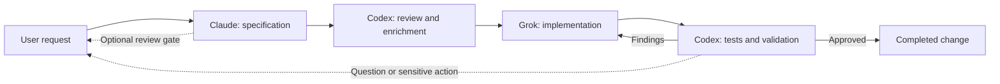
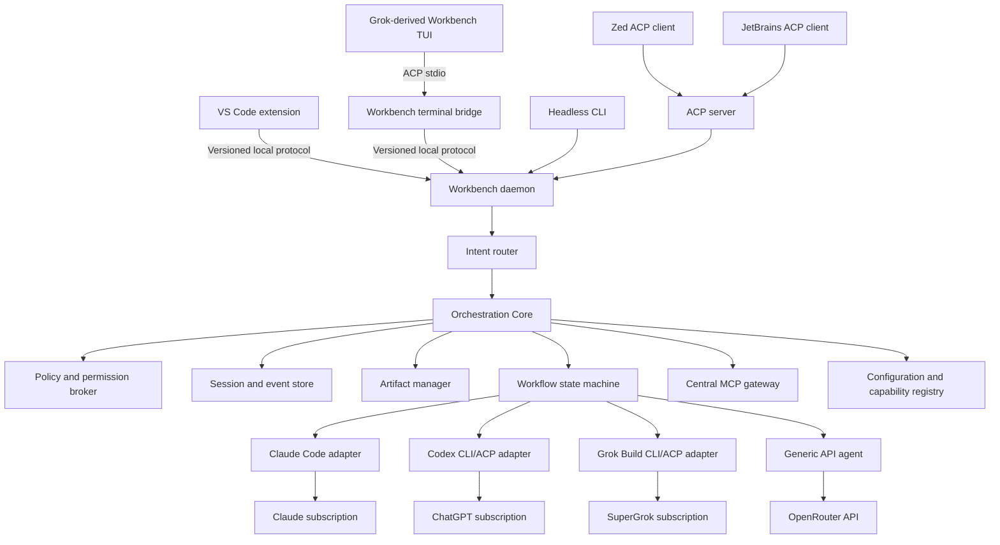

# Multi-Agent Development Workbench


<p align="center">
  
  
  
  
  
</p>

<p align="center">
  <a href="README.md"><strong>English</strong></a>
  ·
  <a href="README.pt-BR.md">Português Brasileiro</a>
  ·
  <a href="CONTRIBUTING.md">Contributing</a>
  ·
  <a href="SECURITY.md">Security</a>
  ·
  <a href="LICENSE">License</a>
</p>

<p align="center">
  <strong>One workflow. The right model for every engineering role.</strong>
</p>

> [!IMPORTANT]
> Feature 001 now provides the executable, fake-provider kernel foundation:
> a headless CLI, local daemon, encrypted persistence, deterministic routing,
> controls, and acceptance tests. Live model adapters, the VS Code extension,
> ACP/MCP integration, and the Grok-derived TUI remain future features.

## Table of Contents

- [Executive Summary](#executive-summary)
- [Proposed Experience](#proposed-experience)
- [Architecture](#architecture)
- [Configuration and Routing](#configuration-and-routing)
- [Delivery Roadmap](#delivery-roadmap)
- [Speckit source of truth](doc/arch/functional/product-overview.md)

🧭 **Current phase:** feature 001 implementation and release-gate validation.

## Executive Summary

The Multi-Agent Development Workbench is building one place to plan, execute,
review, and supervise software work performed by different AI coding agents.
The implemented foundation proves the provider-independent control plane with a
deterministic fake adapter; later adapters will coordinate Claude, Codex, Grok,
and OpenRouter-backed models according to explicit roles.

The primary interface will be **Visual Studio Code**, using its agent sessions,
custom agents, subagents, handoffs, extension APIs, Git tooling, and native
Markdown and Mermaid preview. A thin TypeScript extension will connect this
experience to the provider-independent Rust core. A terminal client derived
from the open-source Grok Build pager will connect to the same daemon through a
narrow ACP bridge, while ACP compatibility will allow other editors to reuse
the core.

The goal is not to create another AI model. It is to create a provider-independent control plane that makes multiple existing agents behave like one accountable engineering team.

## At a Glance

| One workspace | Role-based routing | Flexible access | Editor-portable |
|---|---|---|---|
| Prompts, progress, artifacts, diffs, and interventions stay together. | Claude specifies, Codex reviews, Grok implements, and workflows remain configurable. | Use native subscriptions or API models through OpenRouter. | Start in VS Code, continue in the terminal, and connect other editors through ACP. |

**Core principles:** provider independence · explicit handoffs · human control · durable sessions · auditable execution · specification-first delivery.

## Problem

Working with several AI tools currently requires separate windows, sessions, prompts, instruction files, and histories. This creates:

- Inconsistent rules between providers.
- Lost context during manual handoffs.
- Duplicate prompts and repeated repository discovery.
- Concurrent edits and unclear ownership.
- Limited visibility into progress, decisions, and failures.
- No reliable loop between specification, implementation, and validation.

## Proposed Experience

The user starts one session, describes the desired outcome, and selects or reuses a workflow. The orchestrator assigns each stage to the configured agent, streams progress into a unified timeline, persists artifacts, and moves work forward automatically.



The user can interrupt, comment, pause, resume, or redirect the workflow at any time. Human approval gates are configurable by workflow; uncertainty, conflicting requirements, and sensitive operations always stop for confirmation.

## Interfaces

### VS Code Workbench

VS Code is the primary daily workspace:

- Built-in Chat and Agents surfaces for prompts, status, sessions, and interventions.
- Custom agents, subagents, and handoffs for role-oriented interactive work.
- Native Markdown preview with Mermaid rendering.
- Integrated source, Git, diffs, tests, debugging, and terminals.
- Optional isolated Git worktrees for concurrent tasks.

The Workbench extension will add the deterministic workflow view that VS Code does not provide by itself: provider-specific stages, conditional loops, approvals, durable history, and cross-provider audit. It will use stable public extension APIs and a versioned local protocol; workflow and provider logic will remain in Rust.

Specifications will be stored as normal repository files, for example:

```text
doc/arch/
├── sdd/001-feature-name/
│   ├── spec.md
│   ├── plan.md
│   └── tasks.md
├── adr/
├── schemas/
└── specs/features/
```

Reviewers can edit the documents directly or add visible review blocks:

```markdown
> [!REVIEW]
> Clarify the behavior when token rotation fails after the old token expires.
```

### Terminal Interface

The terminal application will reuse the mature Grok Build pager for prompt
editing, scrollback, Markdown and Mermaid, diffs, approvals, tasks, mouse
support, and terminal behavior. It will be built from the
[Workbench Grok Build fork](https://github.com/RenatoTadeuFigueiredo/grok-build)
and will expose the same sessions, workflows, and policies as VS Code:

```bash
workbench
workbench run workflows/feature.yaml
workbench status
workbench attach <session-id>
workbench pause <session-id>
workbench resume <session-id>
workbench cancel <session-id>
workbench daemon
workbench serve-acp
```

The terminal binary is a presentation client, not the orchestrator. It launches
`workbench agent stdio`, which translates ACP into the daemon's versioned local
protocol. The official `grok` executable remains a separate provider runtime
for SuperGrok-backed work. Interactive TUI and structured streaming output will
support local terminals, SSH, scripts, and CI jobs.

## Architecture



All orchestration and application logic, plus every first-party binary, will be implemented in Rust as a small set of independently testable components. The thin VS Code client is the only planned runtime exception:

- **Workflow engine:** deterministic stages, transitions, policy-gated retries,
  and review loops.
- **Intent router:** explicit targets, contextual routing, deterministic queries,
  and coordinator-assisted classification without implicit broadcasts.
- **Configuration registry:** layered configuration, stable role and model
  aliases, capability preflight, lock data, and session snapshots.
- **Provider adapters:** process lifecycle, authentication detection, session resume, cancellation, and normalized events.
- **Policy broker:** shared instructions, tool permissions, and approval rules.
- **Event store:** encrypted durable session history and audit trail, initially
  backed by SQLite.
- **Artifact manager:** specifications, plans, decisions, diffs, and validation reports.
- **Editor bridge:** versioned local protocol between the VS Code extension and Rust daemon.
- **VS Code extension:** thin presentation and command adapter with no orchestration logic.
- **ACP server:** compatibility with Zed, JetBrains, and other ACP clients.
- **Terminal ACP bridge:** presents daemon sessions as a capability-negotiated
  ACP agent to the fork-derived pager.
- **Grok-derived terminal client:** reuses upstream presentation behavior
  without owning workflows, provider credentials, or policy.
- **MCP gateway:** installs, versions, supervises, filters, and audits shared
  MCP servers for every compatible provider.
- **Headless CLI:** portable scripted and CI access to the same core.
- **Generic agent runtime:** tool calling, context management, streaming, cost limits, and approval gates for API-backed models.

## Rust Implementation

Feature 001 is a pinned Rust 1.95 Cargo workspace:

```text
crates/
├── workbench-core/          # Domain model, routing, policy, and ports
├── workbench-config/        # Layers, validation, snapshots, and locks
├── workbench-storage/       # Encrypted SQLite, key stores, export, retention
├── workbench-protocol/      # Strict versioned NDJSON commands and events
├── workbench-daemon/        # Application services and same-user Unix IPC
├── workbench-cli/           # Daemon lifecycle and headless client commands
└── workbench-testkit/       # Deterministic fakes, contracts, acceptance, SLOs
```

Build and exercise the current offline vertical slice:

```bash
make build
cargo run -p workbench-cli -- config validate
cargo run -p workbench-cli -- config lock
cargo run -p workbench-cli -- daemon
# in another terminal:
cargo run -p workbench-cli -- --json status
cargo run -p workbench-cli -- --json session create
```

See the
[feature 001 quickstart](doc/arch/sdd/001-build-the-workbench-orchestration-kernel-foundation-as-a/quickstart.md)
for prompts, event attachment, controls, JSON output, and the complete gate.
Interactive, editor, ACP, MCP, and live-provider crates shown elsewhere in the
architecture are planned, not part of this slice.

The VS Code extension is the only planned first-party component outside Rust because VS Code extensions run in a TypeScript/JavaScript host. It will remain a replaceable client: it renders state, forwards commands, opens artifacts, and streams events from `workbench daemon`. The official Rust ACP SDK will stay isolated behind `workbench-acp` so protocol changes do not leak into the domain model.

The terminal presentation source is maintained separately in the Grok Build
fork. Its `main` branch mirrors upstream exactly; the `workbench` branch carries
the minimal external-backend patch stack. The main Workbench repository pins a
tested fork commit rather than vendoring the pager.

## Configuration and Routing

Providers, model aliases, roles, routing, policies, and workflows will be
declarative. Workflows target stable roles rather than vendor-specific models:

```yaml
version: 1

providers:
  claude:
    type: subscription-cli
  codex:
    type: subscription-cli
  grok:
    type: subscription-cli
  openrouter:
    type: api
    credential_ref: platform:openrouter
    privacy:
      zero_data_retention: true
      data_collection: deny

models:
  coordinator:
    provider: codex
    runtime_model: gpt-5.6-sol
  specification:
    provider: claude
    runtime_model: fable-5
  review:
    provider: codex
    runtime_model: gpt-5.6-sol
  implementation:
    provider: grok
    runtime_model: grok-4.5
  review-fallback:
    provider: grok
    runtime_model: grok-4.5

roles:
  workspace-coordinator:
    model: coordinator
  product-architect:
    model: specification
  critical-reviewer:
    model: review
    fallback_models: [review-fallback]
  implementer:
    model: implementation
  code-reviewer:
    model: review

routing:
  default_role: workspace-coordinator
  confidence_threshold: 0.85

policies:
  default_tool_mode: read-only
  global_deny: []
  production_mutations: approval-required

workflows:
  feature-delivery:
    steps:
      - id: specification
        role: product-architect
      - id: spec-review
        role: critical-reviewer
      - id: implementation
        role: implementer
      - id: validation
        role: code-reviewer
        on_findings: implementation
        max_iterations: 3
```

This is a repository-layer example. Safe built-ins supply omitted empty role
fields; tools and data sources must be declared before a role can reference
them. The resolved configuration is fully explicit and must satisfy the
committed schema.

Configuration resolves from built-in safe defaults, user configuration,
`.workbench/workbench.yaml`, and explicit session overrides. A
deterministic `.workbench/workbench.lock` pins the non-session adapter, model,
MCP, and compatibility data. Session overrides create a linked session lock
without rewriting that base file. Secrets remain in the system keychain and
sensitive session payloads are encrypted with per-session keys.

Every free-form message reaches the daemon first. Explicit targets and active
workflow context take precedence, followed by deterministic status/history
resolvers and the configured coordinator. Before dispatch, the UI shows the
intent, role, resolved model, tools, data sources, permissions, and confidence.
Messages are never broadcast to multiple providers implicitly.

All providers implement a shared capability contract. Adding a model to an
existing adapter or compatible API is configuration-only; a new protocol
requires an isolated Rust adapter. Removing a provider validates affected
aliases and fallbacks without making historical sessions unreadable. Active
sessions retain a redacted configuration snapshot, so model changes affect new
sessions unless explicitly migrated.

Capability preflight distinguishes chat-only models from coding agents by
checking tool calling, structured output, context size, privacy, availability,
cost limits, resume support, and protocol compatibility. The full decision is
documented in
[`docs/architecture/configuration-routing-and-providers.md`](docs/architecture/configuration-routing-and-providers.md).

## Shared Rules and Context

The orchestrator will resolve a canonical instruction set for every stage:

1. Organization policies.
2. Repository `AGENTS.md`.
3. Provider-compatible repository instructions such as `CLAUDE.md`.
4. Workflow and role instructions.
5. The current user request.

The resolved instructions will be visible before execution and injected into every handoff. Provider-native configuration will remain supported, but conflicts will be reported instead of silently choosing one rule.

## Shared MCP and Tools

The daemon will own a canonical MCP manifest and lockfile. Installing or
updating a shared server once will pin its package or image version, checksum,
transport, credential reference, and policy. Compatible agents connect to a
single Workbench MCP gateway and receive role-specific tool allowlists.

Remote HTTP MCP servers naturally share one endpoint. Local stdio servers are
started and supervised by the gateway so provider clients do not independently
download or launch different versions. Credentials remain in the system
keychain or environment and are never written to the manifest.

Provider-native tools such as each agent's built-in file editor, shell, or
patch mechanism remain provider-specific. Capabilities that must behave
identically across Claude, Codex, Grok, and OpenRouter agents will be exposed as
Workbench-managed MCP tools. The gateway records calls, applies approval
policy, redacts secrets, and isolates sessions.

## Authentication and Billing

Native agents will use existing subscriptions; OpenRouter will be an explicit API-backed option:

| Agent or provider | Authentication path | Billing |
|---|---|---|
| Claude | Official Claude Code login | Claude Max |
| Codex | Codex login with ChatGPT | ChatGPT Pro |
| Grok | Grok Build browser/device login | SuperGrok Heavy |
| OpenRouter | API key stored in the system keychain | OpenRouter credits, billed per use |

Credentials remain owned by provider CLIs or the operating-system keychain and must not be copied into workflow files or the session database. The UI will clearly distinguish subscription usage from API usage and report OpenRouter token consumption and cost per stage.

The Grok-derived Workbench terminal does not reuse or access the Grok
subscription credential store. Only the unmodified official `grok` provider
process authenticates to SuperGrok.

VS Code's built-in third-party agent sessions and the providers' official extensions are different billing paths. The Workbench will default to the official Claude Code, Codex, and Grok Build authentication flows so an existing provider subscription is not silently replaced by GitHub Copilot billing. Copilot-backed sessions and VS Code BYOK models may still be used when explicitly selected.

## Editor Portability

VS Code is the first frontend, not the product foundation. Workflows, sessions, provider adapters, rules, and artifacts belong to the Rust core and remain usable without an editor.

- **VS Code:** uses the first-party extension and local editor bridge exposed by `workbench daemon`.
- **Terminal:** uses the Grok-derived Workbench pager through
  `workbench agent stdio`, with no editor dependency.
- **CI and scripts:** use the headless CLI and structured event output.
- **Zed:** connects to the optional `workbench serve-acp` compatibility endpoint.
- **JetBrains:** uses its ACP client and the same compatibility endpoint.

Editor-specific features such as diff presentation, panels, worktrees, and permission dialogs may look different. Capability negotiation will provide safe degradation, while Markdown artifacts and the event log remain the portable source of truth. No workflow, provider, credential, or policy logic may be implemented inside the VS Code extension.

## Safety and Change Control

- Only one workflow stage writes to a working tree at a time by default.
- Read-only reviewers cannot modify files unless the workflow grants permission.
- Commands, edits, approvals, and handoffs are recorded as events.
- Destructive filesystem actions, external publishing, and production mutations require explicit approval.
- Secrets are redacted from logs and never stored in artifacts.
- Cancellation propagates to provider processes without losing the resumable session.

## Performance Strategy

VS Code has a higher baseline resource cost than a native editor, but it removes the need to build an editor, agent-session shell, Git client, debugger, test UI, and Markdown renderer. The extension will activate lazily, reuse native VS Code UI where practical, and avoid a permanent webview process. The Rust daemon and provider processes will start on demand and remain persistent only while useful.

Concurrency limits, bounded event buffers, incremental artifact updates, and process health checks will prevent inactive agents from consuming resources indefinitely. Performance acceptance tests will measure extension activation, idle memory, event-stream responsiveness, and the complete multi-agent workflow rather than editor startup alone.

The terminal path avoids recreating a mature terminal framework. It reuses the
Grok pager's input, rendering, scrollback, and PTY behavior while keeping the
daemon and providers in separate processes. Terminal performance tests will
cover startup, memory, high-volume streaming, cancellation latency, and
reconnection.

## Open-Source Strategy

The orchestration engine will remain independent from any editor or model provider. A versioned local protocol is the primary boundary for the VS Code client, while ACP remains an interoperability boundary for compatible editors and agents. Both terminate at adapters around the same Rust application services.

The VS Code extension will use stable public extension APIs and remain independently replaceable. The MVP will not depend on private or proposed VS Code APIs for core workflow behavior.

[Grok Build](https://github.com/xai-org/grok-build) is Apache-2.0 licensed and
provides the terminal pager used as the Workbench TUI foundation. The
[Workbench fork](https://github.com/RenatoTadeuFigueiredo/grok-build) follows an
upstream-first patch-stack model:

- `main` is a fast-forward-only mirror of `xai-org/grok-build:main`;
- `workbench` contains a small, reviewed external ACP backend;
- product branches start from and target `workbench`;
- upstream updates are rebased on a temporary sync branch, reviewed with
  `git range-diff`, and never auto-merged; and
- release tags and tested upstream commits remain immutable.

The patch must preserve the original Grok backend and reuse its action, effect,
rendering, scrollback, permission, task, and testing architecture. Workflow
logic is not allowed in the fork. The complete decision, patch limits,
compatibility gates, and rollback policy are documented in
[`docs/architecture/grok-build-terminal-integration.md`](docs/architecture/grok-build-terminal-integration.md).

The official [ACP Rust SDK](https://github.com/agentclientprotocol/rust-sdk) will provide protocol types, transports, clients, agents, and proxies. OpenRouter will be integrated through its HTTP API directly from Rust rather than placing an agent runtime in the VS Code extension.

This repository is licensed under the [Apache License 2.0](LICENSE). Reused or modified third-party components must retain their required copyright, license, and notice files.

## MVP Scope

The first usable release will include:

1. Claude, Codex, and Grok process adapters using subscription authentication.
2. A generic Rust agent runtime and OpenRouter adapter with capability and cost controls.
3. Sequential specification, review, implementation, and validation workflows.
4. Encrypted persistent sessions with pause, resume, cancel, and
   human-controlled reconciliation after uncertain outcomes.
5. A thin VS Code extension for prompts, workflow progress, artifacts, approvals, and session control.
6. A Grok-derived terminal client connected through the Workbench ACP bridge,
   plus headless JSON output.
7. Markdown artifacts, Mermaid diagrams, and configurable review gates.
8. Central instruction resolution, MCP lifecycle, tool permissions, and
   approval policies.
9. Layered configuration, explainable intent routing, model aliases, provider
   capability discovery, and safe provider removal.
10. Automated adapter, workflow, terminal compatibility, recovery, and
   end-to-end tests.

Parallel feature branches, remote workers, a visual workflow designer, team collaboration, analytics, deep integration with the VS Code Agents window, and additional editor-specific extensions are follow-up capabilities.

## Current Validation

- The Rust workspace builds an executable same-user daemon and headless CLI
  with strict protocol negotiation and deterministic fake-provider execution.
- Sensitive session payloads are encrypted in SQLite; root keys use macOS
  Keychain or Linux Secret Service, and exports use age encryption.
- The offline gate exercises contract drift, 23/23 Gherkin bindings, request
  replay, recovery, retention, deletion, routing, controls, and zero-network
  behavior.
- Codex headless execution, structured output, and session resume were validated locally.
- Grok headless execution, structured output, session resume, and native ACP were validated locally.
- Grok Build 0.2.111 completed an ACP v1 initialization through
  `grok --no-auto-update agent stdio` and advertised session, prompt,
  authentication, and MCP capabilities without invoking a model.
- A Codex-to-Grok implementation and review loop completed successfully; the reviewer detected an edge-case defect, Grok corrected it, and the final validation passed.
- The Workbench Grok Build fork was verified as an exact upstream mirror before
  defining the downstream `workbench` branch model.
- Source inspection confirmed that the current pager spawns only its in-process
  GrokShell backend; the bounded external ACP backend is therefore a required
  implementation spike.
- Claude requires local account reauthentication before the full three-provider end-to-end test can be completed.
- OpenRouter integration and model capability preflight remain to be validated in the Rust spike.
- VS Code agent, extension, model-provider, Markdown, and Mermaid capabilities have been evaluated from current public interfaces; the thin extension-to-daemon bridge still requires a local spike.

## Success Criteria

The MVP is successful when a user can submit one feature request and:

- Follow every stage from a single VS Code Workbench conversation or terminal session.
- Inspect and comment on rendered specifications before or during execution.
- Automatically complete at least one implementation-review-fix loop.
- Apply the same repository rules to native and API-backed agents.
- Resume safely after an editor restart or provider failure.
- Distinguish subscription consumption from OpenRouter API cost for every stage.
- Open the same persisted session from VS Code and the terminal interface.
- Replace a role's model without changing its workflow, and explain every
  automatic routing decision before execution.
- Review a complete audit trail of prompts, decisions, commands, edits, and results.

## Project Readiness

| Foundation | Status | Owner |
|---|---|---|
| Product vision, architecture, and MVP boundary | Ready | This README |
| Public licensing and third-party notice policy | Ready | `LICENSE` and `NOTICE` |
| Contribution and vulnerability reporting policies | Ready | `CONTRIBUTING.md` and `SECURITY.md` |
| Shared repository instructions | Ready | `AGENTS.md` |
| Encoding, line endings, and GitHub collaboration templates | Ready | Repository configuration |
| Grok Build terminal integration decision and update policy | Ready | `docs/architecture/grok-build-terminal-integration.md` |
| Configuration, routing, and provider modularity decision | Ready | `docs/architecture/configuration-routing-and-providers.md` |
| Speckit scaffold, constitution, and governance baseline | Ready | `doc/arch/` |
| First active feature and validated specification corpus | Ready | [Feature 001](doc/arch/sdd/001-build-the-workbench-orchestration-kernel-foundation-as-a/spec.md) |
| Orchestration-kernel technical plan | Ready | [Feature 001 plan](doc/arch/sdd/001-build-the-workbench-orchestration-kernel-foundation-as-a/plan.md) |
| Ordered tasks and cross-artifact analysis | Ready | Feature 001 tasks and analysis |
| Cargo workspace and executable fake-provider vertical slice | Implemented | Seven Rust crates |
| Encrypted persistence, local protocol, CLI, and acceptance suite | Implemented | Feature 001 |
| VS Code extension-to-daemon API spike | Pending | Later Speckit feature |
| Fork external-ACP backend and two-snapshot rebase spike | Pending | Later Speckit feature |
| Live MCP gateway and production provider adapters | Pending | Later Speckit features |

Feature 001 pins Rust 1.95.0 and direct dependencies. The default `make check`
gate is deterministic and offline; real Keychain/Secret Service coverage runs
through the explicit `make test-platform` gate on macOS and Linux.

## Specification-First Delivery

This README defines the product vision; `doc/arch/` defines implementation
requirements. Feature 001 has completed the Speckit workflow through
`implement` and is finishing its release evidence:

```text
specify → clarify → plan → tasks → analyze → implement
```

Each phase produces reviewable Markdown artifacts, and `speckit validate` must
pass before a corpus or implementation commit. Future behavior changes require
a tracked change and a new or active Speckit feature before product code.

## Next Steps

1. Review and merge feature 001 after every offline and platform gate passes.
2. Specify the VS Code client, then the bounded Grok Build external-ACP spike.
3. Specify and implement live Claude, Codex, Grok, OpenRouter, and MCP adapters
   independently against the proven core contracts.
4. Expose shared sessions in VS Code and terminal clients, then pilot the
   complete workflow on a non-critical repository.

## References

- [VS Code Agents](https://code.visualstudio.com/docs/agents/overview)
- [VS Code Custom Agents and Handoffs](https://code.visualstudio.com/docs/agent-customization/custom-agents)
- [VS Code Subagents](https://code.visualstudio.com/docs/agents/subagents)
- [VS Code Third-Party Agents](https://code.visualstudio.com/docs/agents/agent-types/third-party-agents)
- [VS Code Chat Participant API](https://code.visualstudio.com/api/extension-guides/ai/chat)
- [VS Code Language Models and BYOK](https://code.visualstudio.com/docs/agent-customization/language-models)
- [VS Code Markdown and Mermaid](https://code.visualstudio.com/docs/languages/markdown)
- [Agent Client Protocol](https://agentclientprotocol.com/)
- [ACP Rust SDK](https://github.com/agentclientprotocol/rust-sdk)
- [Grok Build documentation](https://docs.x.ai/build/overview)
- [Grok Build source](https://github.com/xai-org/grok-build)
- [Workbench Grok Build fork](https://github.com/RenatoTadeuFigueiredo/grok-build)
- [Grok Build terminal integration decision](docs/architecture/grok-build-terminal-integration.md)
- [Configuration, routing, and provider modularity decision](docs/architecture/configuration-routing-and-providers.md)
- [OpenRouter API](https://openrouter.ai/docs/quickstart)
- [Claude Code for VS Code](https://code.claude.com/docs/en/ide-integrations)
- [Codex authentication](https://learn.chatgpt.com/docs/auth)
- [Zed External Agents](https://zed.dev/docs/ai/external-agents)
- [JetBrains ACP support](https://blog.jetbrains.com/ai/2026/02/koog-x-acp-connect-an-agent-to-your-ide-and-more/)
