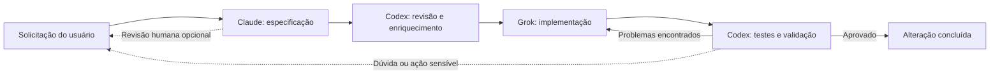
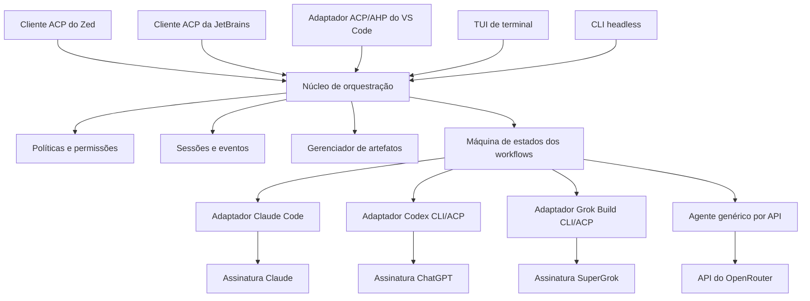

# Workbench de Desenvolvimento Multiagente

> **Status:** Proposta de projeto e descoberta técnica. O produto de orquestração ainda não foi implementado.

## Resumo executivo

O Workbench de Desenvolvimento Multiagente oferecerá um único local para planejar, executar, revisar e supervisionar trabalhos de desenvolvimento realizados por diferentes agentes de IA. Ele coordenará Claude, Codex, Grok e modelos acessados pelo OpenRouter de acordo com papéis explícitos. Os agentes nativos preservarão as assinaturas e autenticações já utilizadas com cada fornecedor, enquanto o OpenRouter oferecerá acesso opcional, cobrado por uso, a um catálogo mais amplo de modelos.

A interface principal será o **Zed**, escolhido por sua performance nativa, suporte a Markdown e Mermaid, experiência com agentes paralelos e integração com o Agent Client Protocol (ACP). O mesmo mecanismo de orquestração também disponibilizará uma interface leve de terminal para trabalho remoto, automações e ambientes nos quais um editor gráfico não seja necessário.

O objetivo não é criar outro modelo de IA. É criar um plano de controle independente de fornecedor que faça diferentes agentes existentes trabalharem como uma única equipe de engenharia, com responsabilidades e resultados auditáveis.

## Problema

Trabalhar atualmente com várias ferramentas de IA exige janelas, sessões, prompts, arquivos de instruções e históricos separados. Isso provoca:

- Regras inconsistentes entre fornecedores.
- Perda de contexto durante transferências manuais.
- Prompts duplicados e análise repetida do repositório.
- Edições concorrentes e responsabilidades pouco claras.
- Baixa visibilidade sobre progresso, decisões e falhas.
- Ausência de um ciclo confiável entre especificação, implementação e validação.

## Experiência proposta

O usuário inicia uma única sessão, descreve o resultado desejado e seleciona ou reutiliza um workflow. O orquestrador atribui cada etapa ao agente configurado, transmite o progresso em uma timeline unificada, persiste os artefatos e avança automaticamente.



O usuário poderá interromper, comentar, pausar, retomar ou redirecionar o workflow a qualquer momento. As aprovações humanas serão configuráveis por workflow; incertezas, requisitos conflitantes e operações sensíveis sempre solicitarão confirmação.

## Interfaces

### Workbench no Zed

O Zed será o ambiente principal de trabalho:

- Uma única visualização para projeto, Git, terminais e threads de agentes.
- Conversa unificada para prompts, status, resultados e intervenções.
- Preview nativo de Markdown com renderização de Mermaid.
- Revisão das diferenças e dos artefatos de especificação gerados.
- Worktrees Git isoladas e opcionais para tarefas concorrentes.

As especificações serão armazenadas como arquivos normais do repositório, por exemplo:

```text
docs/specs/auth-token-rotation/
├── spec.md
├── plan.md
├── decisions.md
└── validation.md
```

Os revisores poderão editar os documentos diretamente ou adicionar blocos visíveis de revisão:

```markdown
> [!REVIEW]
> Esclarecer o comportamento quando a rotação falhar depois que o token anterior expirar.
```

### Interface de terminal

A aplicação de terminal utilizará as mesmas sessões, workflows e políticas:

```bash
workbench start workflows/feature.yaml
workbench status
workbench attach <session-id>
workbench pause
workbench resume
workbench serve-acp
```

Uma TUI interativa e uma saída estruturada com streaming permitirão o uso em terminais locais, SSH, scripts e pipelines de CI.

## Arquitetura



Toda a lógica da aplicação e os binários próprios serão implementados em Rust como um pequeno conjunto de componentes testáveis de forma independente:

- **Mecanismo de workflows:** etapas determinísticas, transições, novas tentativas e ciclos de revisão.
- **Adaptadores de fornecedores:** ciclo de vida dos processos, detecção de autenticação, retomada de sessões, cancelamento e normalização de eventos.
- **Gerenciador de políticas:** instruções compartilhadas, permissões de ferramentas e regras de aprovação.
- **Armazenamento de eventos:** histórico durável das sessões e trilha de auditoria, inicialmente com SQLite.
- **Gerenciador de artefatos:** especificações, planos, decisões, diferenças e relatórios de validação.
- **Servidor ACP:** integração com o Zed e outros editores compatíveis.
- **TUI/CLI:** acesso portátil ao mesmo núcleo, sem duplicar comportamentos.
- **Runtime de agente genérico:** tool calling, gerenciamento de contexto, streaming, limites de custo e aprovações para modelos acessados por API.

## Implementação em Rust

O projeto será um workspace Cargo que produzirá um único binário portátil chamado `workbench`:

```text
crates/
├── workbench-core/          # Workflows e modelo de domínio
├── workbench-agent/         # Loop genérico do agente e ferramentas
├── workbench-acp/           # Cliente e servidor ACP
├── workbench-providers/     # Adaptadores Claude, Codex e Grok
├── workbench-openrouter/    # Adaptador da API do OpenRouter
├── workbench-storage/       # SQLite e artefatos
├── workbench-policy/        # Regras, permissões e aprovações
├── workbench-tui/           # Interface de terminal
├── workbench-cli/           # Comandos e execução headless
└── workbench-testkit/       # Agentes falsos e fixtures de integração
```

O mesmo executável oferecerá modos interativo, headless, editor e background:

```bash
workbench                         # Abrir a interface de terminal
workbench run workflow.yaml       # Executar em modo headless
workbench serve-acp               # Conectar Zed ou JetBrains
workbench daemon                  # Manter as sessões em execução
workbench status                  # Inspecionar sessões ativas
```

O SDK oficial do ACP para Rust ficará isolado em `workbench-acp`, impedindo que mudanças no protocolo afetem o modelo de domínio. As CLIs dos fornecedores e os editores continuarão sendo processos externos; uma futura extensão específica para VS Code poderá exigir um adaptador fino em TypeScript, mas não conterá lógica de orquestração.

## Configuração dos workflows

Os workflows serão declarativos e versionados no repositório:

```yaml
name: feature-delivery

providers:
  openrouter:
    type: api
    api_key: keychain:openrouter
    privacy:
      zero_data_retention: true
      data_collection: deny

steps:
  - id: specification
    role: product-architect
    agent: claude
    model: fable-5
    writes: ["docs/specs/**"]

  - id: spec-review
    role: critical-reviewer
    agent: codex
    model: gpt-5.6-sol
    reads: ["docs/specs/**"]
    fallback:
      agent: workbench
      provider: openrouter
      model: anthropic/claude-sonnet
      max_cost_usd: 2.00

  - id: implementation
    role: implementer
    agent: grok
    model: grok-4.5

  - id: validation
    role: code-reviewer
    agent: codex
    on_findings: implementation
    max_iterations: 3
```

Identificadores de modelos, papéis dos agentes, concorrência, aprovações, timeouts e comportamentos alternativos permanecerão configuráveis, em vez de serem incorporados diretamente ao código da aplicação.

Os modelos do OpenRouter passarão por uma verificação de capacidades antes de serem atribuídos. O Workbench diferenciará modelos apenas de chat daqueles adequados para trabalho como agentes de código, verificando tool calling, saída estruturada, tamanho de contexto, política de privacidade, disponibilidade e limites de custo configurados.

## Regras e contexto compartilhados

O orquestrador resolverá um conjunto canônico de instruções para cada etapa:

1. Políticas da organização.
2. `AGENTS.md` do repositório.
3. Instruções do repositório compatíveis com cada fornecedor, como `CLAUDE.md`.
4. Instruções do workflow e do papel do agente.
5. Solicitação atual do usuário.

As instruções resultantes ficarão visíveis antes da execução e serão incluídas em cada transferência. Configurações nativas dos fornecedores continuarão sendo suportadas, mas eventuais conflitos serão informados em vez de resolvidos silenciosamente.

## Autenticação e cobrança

Os agentes nativos utilizarão as assinaturas existentes; o OpenRouter será uma opção explícita por API:

| Agente ou fornecedor | Forma de autenticação | Cobrança |
|---|---|---|
| Claude | Login oficial do Claude Code | Claude Max |
| Codex | Login do Codex com ChatGPT | ChatGPT Pro |
| Grok | Login por navegador ou dispositivo do Grok Build | SuperGrok Heavy |
| OpenRouter | Chave de API armazenada no keychain do sistema | Créditos do OpenRouter, cobrados por uso |

As credenciais permanecerão sob responsabilidade das CLIs dos fornecedores ou do keychain do sistema operacional e não poderão ser copiadas para arquivos de workflow ou para o banco de sessões. A interface distinguirá claramente o uso das assinaturas do uso por API e mostrará o consumo de tokens e o custo do OpenRouter por etapa.

## Portabilidade entre editores

O Zed será a primeira interface, não a fundação do produto. Workflows, sessões, adaptadores, regras e artefatos pertencerão ao núcleo Rust e continuarão utilizáveis sem um editor.

- **Zed:** conectará diretamente a `workbench serve-acp`.
- **JetBrains:** utilizará seu cliente ACP nativo e o mesmo comando de servidor.
- **VS Code:** utilizará uma extensão cliente ACP ou um futuro adaptador fino de ACP para AHP.
- **Terminal/CI:** utilizará a TUI ou a CLI headless sem depender de editor.

Recursos específicos, como apresentação de diffs, painéis, worktrees e diálogos de permissão, poderão ter aparências diferentes. A negociação de capacidades fornecerá degradação segura, enquanto os artefatos Markdown e o log de eventos permanecerão como fontes portáteis da verdade. Nenhuma lógica de workflow ou fornecedor poderá ser implementada dentro de uma extensão do Zed.

## Segurança e controle de alterações

- Por padrão, apenas uma etapa do workflow poderá escrever na árvore de trabalho por vez.
- Revisores somente leitura não poderão modificar arquivos sem autorização do workflow.
- Comandos, edições, aprovações e transferências serão registrados como eventos.
- Ações destrutivas no sistema de arquivos, publicações externas e alterações em produção exigirão aprovação explícita.
- Segredos serão removidos dos logs e nunca armazenados nos artefatos.
- O cancelamento será propagado aos processos dos fornecedores sem perder a sessão retomável.

## Estratégia de performance

O Zed evita o custo básico de uma IDE baseada em Electron, enquanto o núcleo de orquestração em Rust reduz a sobrecarga adicional. Os processos dos fornecedores serão iniciados sob demanda e permanecerão ativos somente enquanto forem úteis. Limites de concorrência, buffers de eventos limitados, atualizações incrementais de artefatos e verificações de integridade impedirão que agentes inativos consumam recursos indefinidamente.

O editor representa apenas parte do custo total: CLIs dos modelos, servidores de linguagem, testes, contêineres e ferramentas de build continuarão sendo processos separados. Por isso, os testes de aceitação de performance medirão o workflow completo, e não apenas o tempo de inicialização do editor.

## Estratégia open source

O mecanismo de orquestração permanecerá independente de qualquer editor ou fornecedor de modelos. O ACP será a fronteira de integração, permitindo adicionar novos clientes e agentes sem reescrever o mecanismo de workflows.

O [Grok Build](https://github.com/xai-org/grok-build) utiliza a licença Apache-2.0 e oferece implementações de referência úteis para TUI em Rust, execução headless, sessões, ferramentas e ACP. Componentes poderão ser reutilizados com as atribuições necessárias, mas o produto não deverá depender de um fork profundo do Grok Build, pois seu repositório público é sincronizado periodicamente a partir do monorepo de origem.

O [SDK oficial do ACP para Rust](https://github.com/agentclientprotocol/rust-sdk) fornecerá tipos do protocolo, transportes, clientes, agentes e proxies. O OpenRouter será integrado diretamente por sua API HTTP a partir do Rust, sem introduzir um runtime de agente em TypeScript.

Este repositório utiliza a [Licença Apache 2.0](LICENSE). Componentes de terceiros reutilizados ou modificados deverão preservar os respectivos arquivos de copyright, licença e avisos.

## Escopo do MVP

A primeira versão utilizável incluirá:

1. Adaptadores para Claude, Codex e Grok com autenticação pelas assinaturas.
2. Runtime de agente genérico em Rust e adaptador OpenRouter com controles de capacidade e custo.
3. Workflows sequenciais de especificação, revisão, implementação e validação.
4. Sessões persistentes com pausa, retomada, cancelamento e nova tentativa.
5. Integração com o Zed por meio de um único agente ACP personalizado.
6. TUI de terminal e saída JSON em modo headless.
7. Artefatos Markdown, diagramas Mermaid e aprovações configuráveis.
8. Resolução central de instruções e políticas de permissão.
9. Testes automatizados de adaptadores, workflows, recuperação e ponta a ponta.

Branches paralelas de funcionalidades, workers remotos, editor visual de workflows, colaboração entre equipes, análises e adaptadores nativos de editor além do ACP serão capacidades posteriores.

## Validações realizadas

- A execução headless, a saída estruturada e a retomada de sessões do Codex foram validadas localmente.
- A execução headless, a saída estruturada, a retomada de sessões e o ACP nativo do Grok foram validados localmente.
- Um ciclo de implementação e revisão entre Codex e Grok foi concluído com sucesso; o revisor detectou um defeito de caso extremo, o Grok realizou a correção e a validação final foi aprovada.
- O Claude requer uma nova autenticação local da conta antes da conclusão do teste ponta a ponta com os três fornecedores.
- A integração com OpenRouter e a verificação das capacidades dos modelos ainda deverão ser validadas no protótipo em Rust.

## Critérios de sucesso

O MVP será considerado bem-sucedido quando um usuário puder enviar uma única solicitação de funcionalidade e:

- Acompanhar todas as etapas por uma única thread no Zed ou sessão de terminal.
- Inspecionar e comentar as especificações renderizadas antes ou durante a execução.
- Concluir automaticamente ao menos um ciclo de implementação, revisão e correção.
- Aplicar as mesmas regras do repositório aos agentes nativos e aos acessados por API.
- Retomar o trabalho com segurança após reiniciar o editor ou ocorrer uma falha no fornecedor.
- Distinguir o consumo das assinaturas do custo da API do OpenRouter em cada etapa.
- Abrir a mesma sessão persistida pelo Zed e pela interface de terminal.
- Revisar uma trilha completa de prompts, decisões, comandos, edições e resultados.

## Desenvolvimento orientado por especificações

Este README define a visão do produto, não seus requisitos de implementação. Antes de iniciar o código do produto, o repositório será inicializado para o Speckit e a primeira feature ativa seguirá todo o ciclo de especificação:

```text
specify → clarify → plan → tasks → analyze → implement
```

Cada fase produzirá artefatos Markdown revisáveis, e `speckit validate` deverá ser aprovado antes que o corpus de especificações ou a implementação da feature sejam considerados concluídos. A primeira feature do Speckit deverá definir o núcleo de orquestração, as fronteiras dos protocolos, a semântica de falhas, o modelo de segurança e os testes de aceitação antes do início dos adaptadores.

## Próximos passos

1. Aprovar esta visão e os limites propostos para o MVP.
2. Inicializar o Speckit e criar a primeira feature ativa para o núcleo de orquestração.
3. Refazer a autenticação do Claude Code e concluir o teste de compatibilidade com os três fornecedores.
4. Produzir um protótipo fino em Rust que cubra ACP, eventos dos fornecedores e tool calling pelo OpenRouter.
5. Implementar somente as fases e tarefas aprovadas pelo Speckit.
6. Disponibilizar o primeiro corte vertical no Zed e no terminal e executar um piloto inicial em um repositório não crítico.

## Referências

- [Agentes externos do Zed](https://zed.dev/docs/ai/external-agents)
- [Agentes paralelos no Zed](https://zed.dev/docs/ai/parallel-agents)
- [Agent Client Protocol](https://agentclientprotocol.com/)
- [SDK do ACP para Rust](https://github.com/agentclientprotocol/rust-sdk)
- [Documentação do Grok Build](https://docs.x.ai/build/overview)
- [Código-fonte do Grok Build](https://github.com/xai-org/grok-build)
- [API do OpenRouter](https://openrouter.ai/docs/quickstart)
- [Suporte ACP da JetBrains](https://blog.jetbrains.com/ai/2026/02/koog-x-acp-connect-an-agent-to-your-ide-and-more/)
- [Cliente ACP para VS Code](https://github.com/formulahendry/vscode-acp)
