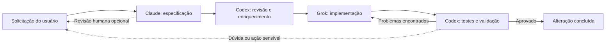
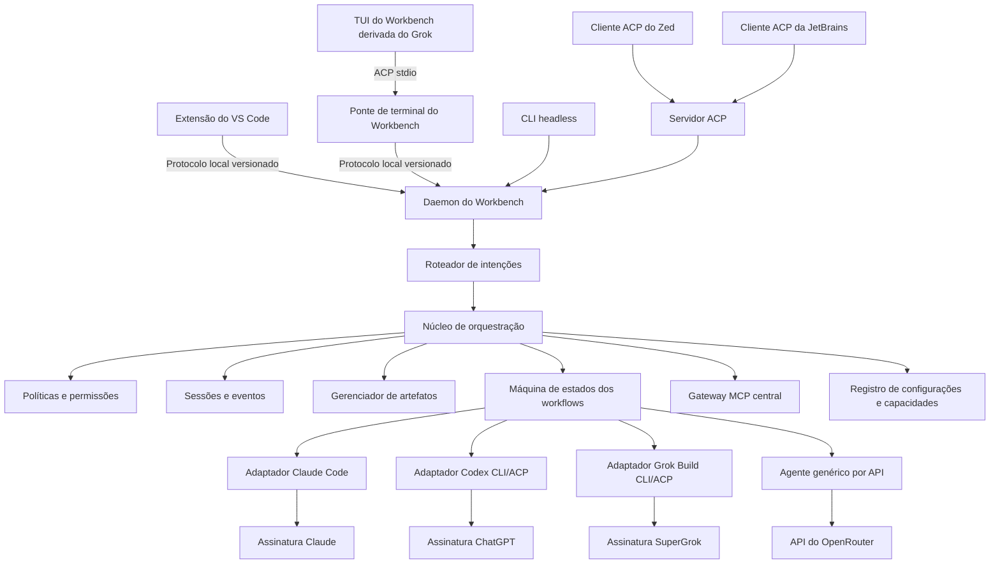

# Workbench de Desenvolvimento Multiagente


<p align="center">
  
  
  
  
  
</p>

<p align="center">
  <a href="README.md">English</a>
  ·
  <a href="README.pt-BR.md"><strong>Português Brasileiro</strong></a>
  ·
  <a href="CONTRIBUTING.md">Contribuição</a>
  ·
  <a href="SECURITY.md">Segurança</a>
  ·
  <a href="LICENSE">Licença</a>
</p>

<p align="center">
  <strong>Um único workflow. O modelo certo para cada papel de engenharia.</strong>
</p>

> [!IMPORTANT]
> Este projeto está na fase de design e especificação. O produto ainda não foi implementado; o corpus validado do Speckit contém os requisitos e o plano técnico ativos.

## Sumário

- [Resumo executivo](#resumo-executivo)
- [Experiência proposta](#experiência-proposta)
- [Arquitetura](#arquitetura)
- [Configuração e roteamento](#configuração-e-roteamento)
- [Roteiro de entrega](#roteiro-de-entrega)
- [Fonte de verdade do Speckit](doc/arch/functional/product-overview.md)

🧭 **Fase atual:** plano técnico da feature 001 concluído; a decomposição das tarefas é o próximo passo.

## Resumo executivo

O Workbench de Desenvolvimento Multiagente oferecerá um único local para planejar, executar, revisar e supervisionar trabalhos de desenvolvimento realizados por diferentes agentes de IA. Ele coordenará Claude, Codex, Grok e modelos acessados pelo OpenRouter de acordo com papéis explícitos. Os agentes nativos preservarão as assinaturas e autenticações já utilizadas com cada fornecedor, enquanto o OpenRouter oferecerá acesso opcional, cobrado por uso, a um catálogo mais amplo de modelos.

A interface principal será o **Visual Studio Code**, aproveitando suas sessões
agênticas, agentes personalizados, subagentes, handoffs, APIs de extensão,
ferramentas Git e preview nativo de Markdown e Mermaid. Uma extensão fina em
TypeScript conectará essa experiência ao núcleo Rust independente de
fornecedor. Um cliente de terminal derivado do pager open source do Grok Build
se conectará ao mesmo daemon por uma ponte ACP estreita, enquanto a
compatibilidade ACP permitirá que outros editores reutilizem o núcleo.

O objetivo não é criar outro modelo de IA. É criar um plano de controle independente de fornecedor que faça diferentes agentes existentes trabalharem como uma única equipe de engenharia, com responsabilidades e resultados auditáveis.

## Visão geral

| Um workspace | Roteamento por papéis | Acesso flexível | Portável entre editores |
|---|---|---|---|
| Prompts, progresso, artefatos, diffs e intervenções permanecem juntos. | Claude especifica, Codex revisa, Grok implementa e os workflows continuam configuráveis. | Utilize assinaturas nativas ou modelos por API através do OpenRouter. | Comece no VS Code, continue no terminal e conecte outros editores por ACP. |

**Princípios centrais:** independência de fornecedor · transferências explícitas · controle humano · sessões duráveis · execução auditável · especificação antes da implementação.

## Problema

Trabalhar atualmente com várias ferramentas de IA exige janelas, sessões, prompts, arquivos de instruções e históricos separados. Isso provoca:

- Regras inconsistentes entre fornecedores.
- Perda de contexto durante transferências manuais.
- Prompts duplicados e análise repetida do repositório.
- Edições concorrentes e responsabilidades pouco claras.
- Baixa visibilidade sobre progresso, decisões e falhas.
- Ausência de um ciclo confiável entre especificação, implementação e validação.

## Experiência proposta

O usuário inicia uma única sessão, descreve o resultado desejado e seleciona ou reutiliza um workflow. O orquestrador atribui cada etapa ao agente configurado, transmite o progresso em uma timeline unificada, persiste os artefatos e avança automaticamente.



O usuário poderá interromper, comentar, pausar, retomar ou redirecionar o workflow a qualquer momento. As aprovações humanas serão configuráveis por workflow; incertezas, requisitos conflitantes e operações sensíveis sempre solicitarão confirmação.

## Interfaces

### Workbench no VS Code

O VS Code será o ambiente principal de trabalho:

- Interfaces nativas de Chat e Agents para prompts, status, sessões e intervenções.
- Agentes personalizados, subagentes e handoffs para trabalho interativo orientado por papéis.
- Preview nativo de Markdown com renderização de Mermaid.
- Código, Git, diffs, testes, depuração e terminais integrados.
- Worktrees Git isoladas e opcionais para tarefas concorrentes.

A extensão do Workbench acrescentará a visão determinística que o VS Code não oferece sozinho: etapas vinculadas a fornecedores, ciclos condicionais, aprovações, histórico durável e auditoria entre fornecedores. Ela utilizará APIs públicas estáveis e um protocolo local versionado; a lógica dos workflows e fornecedores permanecerá em Rust.

As especificações serão armazenadas como arquivos normais do repositório, por exemplo:

```text
doc/arch/
├── sdd/001-nome-da-feature/
│   ├── spec.md
│   ├── plan.md
│   └── tasks.md
├── adr/
├── schemas/
└── specs/features/
```

Os revisores poderão editar os documentos diretamente ou adicionar blocos visíveis de revisão:

```markdown
> [!REVIEW]
> Esclarecer o comportamento quando a rotação falhar depois que o token anterior expirar.
```

### Interface de terminal

A aplicação de terminal reutilizará o pager maduro do Grok Build para edição de
prompts, scrollback, Markdown e Mermaid, diffs, aprovações, tarefas, mouse e
comportamento do terminal. Ela será construída a partir do
[fork do Grok Build do Workbench](https://github.com/RenatoTadeuFigueiredo/grok-build)
e disponibilizará as mesmas sessões, workflows e políticas do VS Code:

```bash
workbench
workbench run workflows/feature.yaml
workbench status
workbench attach <session-id>
workbench pause <session-id>
workbench resume <session-id>
workbench cancel <session-id>
workbench daemon
workbench serve-acp
```

O binário de terminal será um cliente de apresentação, não o orquestrador. Ele
iniciará `workbench agent stdio`, que traduzirá ACP para o protocolo local
versionado do daemon. O executável oficial `grok` continuará sendo um runtime
de provider separado para o trabalho coberto pelo SuperGrok. Uma TUI interativa
e uma saída estruturada com streaming permitirão o uso em terminais locais,
SSH, scripts e pipelines de CI.

## Arquitetura



Toda a lógica de orquestração e da aplicação, além de todos os binários próprios, será implementada em Rust como um pequeno conjunto de componentes testáveis de forma independente. O cliente fino do VS Code será a única exceção de runtime planejada:

- **Mecanismo de workflows:** etapas determinísticas, transições, novas
  tentativas controladas por política e ciclos de revisão.
- **Roteador de intenções:** destinos explícitos, contexto ativo, consultas
  determinísticas e classificação pelo coordenador sem transmissões implícitas.
- **Registro de configurações:** configuração em camadas, aliases estáveis de
  papéis e modelos, verificação de capacidades, lock e snapshots das sessões.
- **Adaptadores de fornecedores:** ciclo de vida dos processos, detecção de autenticação, retomada de sessões, cancelamento e normalização de eventos.
- **Gerenciador de políticas:** instruções compartilhadas, permissões de ferramentas e regras de aprovação.
- **Armazenamento de eventos:** histórico durável e criptografado das sessões e
  trilha de auditoria, inicialmente com SQLite.
- **Gerenciador de artefatos:** especificações, planos, decisões, diferenças e relatórios de validação.
- **Ponte do editor:** protocolo local versionado entre a extensão do VS Code e o daemon Rust.
- **Extensão do VS Code:** adaptador fino de apresentação e comandos, sem lógica de orquestração.
- **Servidor ACP:** compatibilidade com Zed, JetBrains e outros clientes ACP.
- **Ponte ACP de terminal:** apresenta as sessões do daemon como um agente ACP
  com negociação de capacidades para o pager derivado do fork.
- **Cliente de terminal derivado do Grok:** reutiliza o comportamento de
  apresentação upstream sem controlar workflows, credenciais ou políticas.
- **Gateway MCP:** instala, versiona, supervisiona, filtra e audita servidores
  MCP compartilhados por todos os providers compatíveis.
- **CLI headless:** acesso portátil para scripts e CI ao mesmo núcleo.
- **Runtime de agente genérico:** tool calling, gerenciamento de contexto, streaming, limites de custo e aprovações para modelos acessados por API.

## Implementação em Rust

O repositório do plano de controle será um workspace Cargo que produzirá o
daemon, a CLI headless, os adaptadores de providers e a ponte de terminal:

```text
crates/
├── workbench-core/          # Workflows e modelo de domínio
├── workbench-config/        # Schema em camadas, aliases, locks e snapshots
├── workbench-routing/       # Intenções, seleção de papéis e explicabilidade
├── workbench-agent/         # Loop genérico do agente e ferramentas
├── workbench-acp/           # Cliente/servidor ACP de providers e editores
├── workbench-daemon/        # Ponte local do editor e host de processos
├── workbench-providers/     # Adaptadores Claude, Codex e Grok
├── workbench-openrouter/    # Adaptador da API do OpenRouter
├── workbench-storage/       # SQLite e artefatos
├── workbench-policy/        # Regras, permissões e aprovações
├── workbench-mcp/           # Registro, lock, gateway e políticas de MCP
├── workbench-terminal/      # Ponte ACP consumida pelo pager derivado do Grok
├── workbench-cli/           # Comandos e execução headless
└── workbench-testkit/       # Agentes falsos e fixtures de integração
extensions/
└── vscode/                   # Cliente TypeScript fino para o daemon Rust
```

Os binários do Workbench oferecerão modos interativo, headless, editor e
background:

```bash
workbench                         # Abrir a TUI derivada do Grok
workbench run workflow.yaml       # Executar em modo headless
workbench daemon                  # Atender o VS Code e manter as sessões em execução
workbench agent stdio             # Ponte ACP utilizada pelo pager de terminal
workbench serve-acp               # Conectar Zed, JetBrains ou outro cliente ACP
workbench status                  # Inspecionar sessões ativas
```

A extensão do VS Code será o único componente próprio planejado fora de Rust, pois extensões do VS Code executam em um host TypeScript/JavaScript. Ela continuará sendo um cliente substituível: exibirá o estado, encaminhará comandos, abrirá artefatos e transmitirá eventos do `workbench daemon`. O SDK oficial do ACP para Rust ficará isolado em `workbench-acp`, impedindo que mudanças no protocolo afetem o modelo de domínio.

O código de apresentação do terminal será mantido separadamente no fork do
Grok Build. Sua branch `main` espelhará exatamente o upstream; a branch
`workbench` carregará a patch stack mínima do backend externo. O repositório
principal do Workbench fixará um commit testado do fork em vez de vendorizar o
pager.

## Configuração e roteamento

Providers, aliases de modelos, papéis, roteamento, políticas e workflows serão
declarativos. Os workflows utilizarão papéis estáveis em vez de modelos
específicos de fornecedores:

```yaml
version: 1

providers:
  claude:
    type: subscription-cli
  codex:
    type: subscription-cli
  grok:
    type: subscription-cli
  openrouter:
    type: api
    credential_ref: platform:openrouter
    privacy:
      zero_data_retention: true
      data_collection: deny

models:
  coordinator:
    provider: codex
    runtime_model: gpt-5.6-sol
  specification:
    provider: claude
    runtime_model: fable-5
  review:
    provider: codex
    runtime_model: gpt-5.6-sol
  implementation:
    provider: grok
    runtime_model: grok-4.5
  review-fallback:
    provider: grok
    runtime_model: grok-4.5

roles:
  workspace-coordinator:
    model: coordinator
    tools: [repository, git, sessions, gitlab]
  product-architect:
    model: specification
  critical-reviewer:
    model: review
    fallback_models: [review-fallback]
  implementer:
    model: implementation
  code-reviewer:
    model: review

routing:
  default_role: workspace-coordinator
  confidence_threshold: 0.85

policies:
  default_tool_mode: read-only
  global_deny: []
  production_mutations: approval-required

workflows:
  feature-delivery:
    steps:
      - id: specification
        role: product-architect
      - id: spec-review
        role: critical-reviewer
      - id: implementation
        role: implementer
      - id: validation
        role: code-reviewer
        on_findings: implementation
        max_iterations: 3
```

Este é um exemplo da camada do repositório. Os padrões seguros preenchem campos
vazios omitidos dos papéis e as ferramentas embutidas; a configuração resolvida
é totalmente explícita e deve obedecer ao schema versionado.

As configurações serão resolvidas a partir dos padrões seguros embutidos, da
configuração do usuário, de `.workbench/workbench.yaml` e dos overrides
explícitos da sessão. Um `.workbench/workbench.lock` determinístico fixará
adaptadores, modelos, MCPs e dados de compatibilidade fora da sessão. Overrides
de sessão criarão um lock vinculado sem reescrever esse arquivo-base. Os
segredos permanecerão no keychain, e os dados sensíveis das sessões serão
criptografados com chaves individuais.

Toda mensagem livre chegará primeiro ao daemon. Destinos explícitos e o
contexto do workflow terão precedência, seguidos por consultas determinísticas
de status/histórico e pelo coordenador configurado. Antes do envio, a interface
mostrará intenção, papel, modelo resolvido, ferramentas, fontes de dados,
permissões e confiança. Mensagens nunca serão transmitidas implicitamente para
vários providers.

Todos os providers implementarão o mesmo contrato de capacidades. Adicionar um
modelo a um adaptador existente ou API compatível exigirá apenas configuração;
um novo protocolo exigirá um adaptador Rust isolado. Remover um provider
validará aliases e fallbacks afetados sem tornar o histórico ilegível. Sessões
ativas manterão um snapshot sem segredos, portanto mudanças de modelo valerão
para novas sessões, salvo migração explícita.

A verificação de capacidades diferenciará modelos de chat de agentes de código
avaliando tool calling, saída estruturada, contexto, privacidade,
disponibilidade, custos, retomada de sessões e compatibilidade de protocolo. A
decisão completa está em
[`docs/architecture/configuration-routing-and-providers.md`](docs/architecture/configuration-routing-and-providers.md).

## Regras e contexto compartilhados

O orquestrador resolverá um conjunto canônico de instruções para cada etapa:

1. Políticas da organização.
2. `AGENTS.md` do repositório.
3. Instruções do repositório compatíveis com cada fornecedor, como `CLAUDE.md`.
4. Instruções do workflow e do papel do agente.
5. Solicitação atual do usuário.

As instruções resultantes ficarão visíveis antes da execução e serão incluídas em cada transferência. Configurações nativas dos fornecedores continuarão sendo suportadas, mas eventuais conflitos serão informados em vez de resolvidos silenciosamente.

## MCPs e ferramentas compartilhadas

O daemon controlará um manifesto e um lockfile MCP canônicos. Instalar ou
atualizar um servidor compartilhado uma única vez fixará a versão do pacote ou
imagem, checksum, transporte, referência de credencial e política. Os agentes
compatíveis se conectarão a um único Gateway MCP do Workbench e receberão
allowlists de ferramentas específicas para cada papel.

Servidores MCP HTTP remotos compartilharão naturalmente um único endpoint.
Servidores stdio locais serão iniciados e supervisionados pelo gateway, evitando
que cada provider baixe ou execute versões diferentes. Credenciais permanecerão
no keychain do sistema ou no ambiente e nunca serão gravadas no manifesto.

Ferramentas nativas, como o editor de arquivos, shell ou mecanismo de patch de
cada agente, continuarão específicas do provider. Capacidades que precisem se
comportar da mesma maneira em Claude, Codex, Grok e agentes do OpenRouter serão
expostas como ferramentas MCP gerenciadas pelo Workbench. O gateway registrará
chamadas, aplicará políticas de aprovação, removerá segredos dos logs e isolará
sessões.

## Autenticação e cobrança

Os agentes nativos utilizarão as assinaturas existentes; o OpenRouter será uma opção explícita por API:

| Agente ou fornecedor | Forma de autenticação | Cobrança |
|---|---|---|
| Claude | Login oficial do Claude Code | Claude Max |
| Codex | Login do Codex com ChatGPT | ChatGPT Pro |
| Grok | Login por navegador ou dispositivo do Grok Build | SuperGrok Heavy |
| OpenRouter | Chave de API armazenada no keychain do sistema | Créditos do OpenRouter, cobrados por uso |

As credenciais permanecerão sob responsabilidade das CLIs dos fornecedores ou do keychain do sistema operacional e não poderão ser copiadas para arquivos de workflow ou para o banco de sessões. A interface distinguirá claramente o uso das assinaturas do uso por API e mostrará o consumo de tokens e o custo do OpenRouter por etapa.

O terminal do Workbench derivado do Grok não reutilizará nem acessará o
armazenamento de credenciais da assinatura Grok. Somente o processo oficial e
não modificado do provider `grok` autenticará no SuperGrok.

As sessões nativas de agentes externos do VS Code e as extensões oficiais dos fornecedores representam formas diferentes de cobrança. O Workbench utilizará por padrão os fluxos oficiais de autenticação do Claude Code, Codex e Grok Build para não substituir silenciosamente uma assinatura existente por cobrança do GitHub Copilot. Sessões via Copilot e modelos BYOK do VS Code continuarão disponíveis quando selecionados explicitamente.

## Portabilidade entre editores

O VS Code será a primeira interface, não a fundação do produto. Workflows, sessões, adaptadores, regras e artefatos pertencerão ao núcleo Rust e continuarão utilizáveis sem um editor.

- **VS Code:** utilizará a extensão própria e a ponte local exposta por `workbench daemon`.
- **Terminal:** utilizará o pager do Workbench derivado do Grok por meio de
  `workbench agent stdio`, sem depender de editor.
- **CI e scripts:** utilizarão a CLI headless e a saída estruturada de eventos.
- **Zed:** conectará ao endpoint opcional de compatibilidade `workbench serve-acp`.
- **JetBrains:** utilizará seu cliente ACP e o mesmo endpoint de compatibilidade.

Recursos específicos, como apresentação de diffs, painéis, worktrees e diálogos de permissão, poderão ter aparências diferentes. A negociação de capacidades fornecerá degradação segura, enquanto os artefatos Markdown e o log de eventos permanecerão como fontes portáteis da verdade. Nenhuma lógica de workflow, fornecedor, credencial ou política poderá ser implementada dentro da extensão do VS Code.

## Segurança e controle de alterações

- Por padrão, apenas uma etapa do workflow poderá escrever na árvore de trabalho por vez.
- Revisores somente leitura não poderão modificar arquivos sem autorização do workflow.
- Comandos, edições, aprovações e transferências serão registrados como eventos.
- Ações destrutivas no sistema de arquivos, publicações externas e alterações em produção exigirão aprovação explícita.
- Segredos serão removidos dos logs e nunca armazenados nos artefatos.
- O cancelamento será propagado aos processos dos fornecedores sem perder a sessão retomável.

## Estratégia de performance

O VS Code possui um custo básico de recursos superior ao de um editor nativo, mas elimina a necessidade de construir um editor, uma interface de sessões agênticas, um cliente Git, um depurador, uma interface de testes e um renderizador de Markdown. A extensão será ativada sob demanda, reutilizará a interface nativa do VS Code quando possível e evitará um processo permanente de webview. O daemon Rust e os processos dos fornecedores serão iniciados somente quando necessários.

Limites de concorrência, buffers de eventos limitados, atualizações incrementais de artefatos e verificações de integridade impedirão que agentes inativos consumam recursos indefinidamente. Os testes de aceitação medirão a ativação da extensão, memória ociosa, responsividade do streaming de eventos e o workflow multiagente completo, não apenas a inicialização do editor.

O caminho de terminal evitará recriar um framework de terminal maduro.
Reutilizaremos a entrada, renderização, scrollback e comportamento PTY do pager
do Grok, mantendo o daemon e os providers em processos separados. Os testes de
performance do terminal cobrirão inicialização, memória, streaming de alto
volume, latência de cancelamento e reconexão.

## Estratégia open source

O mecanismo de orquestração permanecerá independente de qualquer editor ou fornecedor de modelos. Um protocolo local versionado será a fronteira principal do cliente VS Code, enquanto o ACP continuará sendo uma fronteira de interoperabilidade para editores e agentes compatíveis. Ambos terminarão em adaptadores sobre os mesmos serviços da aplicação em Rust.

A extensão do VS Code utilizará APIs públicas estáveis e continuará substituível de forma independente. O MVP não dependerá de APIs privadas ou propostas do VS Code para comportamentos centrais do workflow.

O [Grok Build](https://github.com/xai-org/grok-build) utiliza a licença
Apache-2.0 e fornece o pager de terminal usado como fundação da TUI do
Workbench. O
[fork do Workbench](https://github.com/RenatoTadeuFigueiredo/grok-build)
seguirá um modelo upstream-first com patch stack:

- `main` será um espelho somente fast-forward de `xai-org/grok-build:main`;
- `workbench` conterá um backend ACP externo pequeno e revisado;
- branches de produto nascerão de e voltarão para `workbench`;
- atualizações upstream serão aplicadas por rebase em uma branch temporária de
  sincronização, revisadas com `git range-diff` e nunca terão merge automático;
- tags de release e commits upstream testados serão imutáveis.

O patch preservará o backend original do Grok e reutilizará sua arquitetura de
ações, efeitos, renderização, scrollback, permissões, tarefas e testes. A lógica
de workflows não poderá ser implementada no fork. A decisão completa, limites
do patch, gates de compatibilidade e política de rollback estão documentados em
[`docs/architecture/grok-build-terminal-integration.md`](docs/architecture/grok-build-terminal-integration.md).

O [SDK oficial do ACP para Rust](https://github.com/agentclientprotocol/rust-sdk) fornecerá tipos do protocolo, transportes, clientes, agentes e proxies. O OpenRouter será integrado diretamente por sua API HTTP a partir do Rust, sem colocar um runtime de agente dentro da extensão do VS Code.

Este repositório utiliza a [Licença Apache 2.0](LICENSE). Componentes de terceiros reutilizados ou modificados deverão preservar os respectivos arquivos de copyright, licença e avisos.

## Escopo do MVP

A primeira versão utilizável incluirá:

1. Adaptadores para Claude, Codex e Grok com autenticação pelas assinaturas.
2. Runtime de agente genérico em Rust e adaptador OpenRouter com controles de capacidade e custo.
3. Workflows sequenciais de especificação, revisão, implementação e validação.
4. Sessões persistentes criptografadas com pausa, retomada, cancelamento e
   reconciliação humana após resultados incertos.
5. Extensão fina do VS Code para prompts, progresso do workflow, artefatos, aprovações e controle de sessões.
6. Cliente de terminal derivado do Grok conectado pela ponte ACP do Workbench,
   além de saída JSON em modo headless.
7. Artefatos Markdown, diagramas Mermaid e aprovações configuráveis.
8. Resolução central de instruções, ciclo de vida dos MCPs, permissões de
   ferramentas e políticas de aprovação.
9. Configuração em camadas, roteamento de intenções explicável, aliases de
   modelos, descoberta de capacidades e remoção segura de providers.
10. Testes automatizados de adaptadores, workflows, compatibilidade do terminal,
   recuperação e ponta a ponta.

Branches paralelas de funcionalidades, workers remotos, editor visual de workflows, colaboração entre equipes, análises, integração profunda com a janela Agents do VS Code e extensões específicas para outros editores serão capacidades posteriores.

## Validações realizadas

- A execução headless, a saída estruturada e a retomada de sessões do Codex foram validadas localmente.
- A execução headless, a saída estruturada, a retomada de sessões e o ACP nativo do Grok foram validados localmente.
- O Grok Build 0.2.111 concluiu uma inicialização ACP v1 por meio de
  `grok --no-auto-update agent stdio` e anunciou capacidades de sessão, prompt,
  autenticação e MCP sem invocar um modelo.
- Um ciclo de implementação e revisão entre Codex e Grok foi concluído com sucesso; o revisor detectou um defeito de caso extremo, o Grok realizou a correção e a validação final foi aprovada.
- O fork do Grok Build do Workbench foi verificado como um espelho exato do
  upstream antes da definição do modelo da branch downstream `workbench`.
- A inspeção do código confirmou que o pager atual inicia apenas seu GrokShell
  em processo; portanto, o backend ACP externo limitado é um spike obrigatório
  de implementação.
- O Claude requer uma nova autenticação local da conta antes da conclusão do teste ponta a ponta com os três fornecedores.
- A integração com OpenRouter e a verificação das capacidades dos modelos ainda deverão ser validadas no protótipo em Rust.
- As capacidades públicas do VS Code para agentes, extensões, fornecedores de modelos, Markdown e Mermaid foram avaliadas; a ponte fina entre a extensão e o daemon ainda precisa de um protótipo local.

## Critérios de sucesso

O MVP será considerado bem-sucedido quando um usuário puder enviar uma única solicitação de funcionalidade e:

- Acompanhar todas as etapas por uma única conversa do Workbench no VS Code ou sessão de terminal.
- Inspecionar e comentar as especificações renderizadas antes ou durante a execução.
- Concluir automaticamente ao menos um ciclo de implementação, revisão e correção.
- Aplicar as mesmas regras do repositório aos agentes nativos e aos acessados por API.
- Retomar o trabalho com segurança após reiniciar o editor ou ocorrer uma falha no fornecedor.
- Distinguir o consumo das assinaturas do custo da API do OpenRouter em cada etapa.
- Abrir a mesma sessão persistida pelo VS Code e pela interface de terminal.
- Substituir o modelo de um papel sem alterar o workflow e explicar cada
  decisão automática de roteamento antes da execução.
- Revisar uma trilha completa de prompts, decisões, comandos, edições e resultados.

## Prontidão do projeto

| Fundação | Estado | Responsável |
|---|---|---|
| Visão do produto, arquitetura e limites do MVP | Pronto | Este README |
| Licenciamento público e política de avisos de terceiros | Pronto | `LICENSE` e `NOTICE` |
| Políticas de contribuição e relato de vulnerabilidades | Pronto | `CONTRIBUTING.md` e `SECURITY.md` |
| Instruções compartilhadas do repositório | Pronto | `AGENTS.md` |
| Codificação, quebras de linha e templates de colaboração do GitHub | Pronto | Configuração do repositório |
| Decisão de integração do terminal Grok Build e política de atualização | Pronto | `docs/architecture/grok-build-terminal-integration.md` |
| Decisão de configuração, roteamento e modularidade de providers | Pronto | `docs/architecture/configuration-routing-and-providers.md` |
| Scaffold, constituição e baseline de governança do Speckit | Pronto | `doc/arch/` |
| Primeira feature ativa e corpus de especificações validado | Pronto | [Feature 001](doc/arch/sdd/001-build-the-workbench-orchestration-kernel-foundation-as-a/spec.md) |
| Plano técnico do núcleo de orquestração | Pronto | [Plano da feature 001](doc/arch/sdd/001-build-the-workbench-orchestration-kernel-foundation-as-a/plan.md) |
| Tarefas ordenadas e análise entre artefatos | Próximo | Fases `tasks` e `analyze` do Speckit |
| Workspace Cargo e corte vertical executável com provider falso | Pendente | Fase `implement` do Speckit |
| Protótipo da API entre extensão do VS Code e daemon | Pendente | Feature futura do Speckit |
| Spike do backend ACP externo e rebase entre dois snapshots do fork | Pendente | Feature futura do Speckit |
| Gateway MCP ativo e adaptadores reais de providers | Pendente | Features futuras do Speckit |

O plano já define os limites iniciais do workspace, protocolo local, estratégia
de persistência, abordagem de testes e Rust 1.95.0 para o CI das
especificações. A feature 001 suporta macOS e Linux; os arquivos reais do
toolchain e os pins das dependências do produto só serão adicionados quando a
feature ativa chegar a `implement`.

## Desenvolvimento orientado por especificações

Este README define a visão do produto; `doc/arch/` define os requisitos de
implementação. A feature 001 concluiu `specify`, `clarify` e `plan`:

```text
specify → clarify → plan → tasks → analyze → implement
```

Cada fase produz artefatos Markdown revisáveis, e `speckit validate` deve passar
antes de qualquer commit do corpus ou da implementação. A feature atual define
o núcleo, as fronteiras dos protocolos, semântica de falhas, modelo de
segurança, corte vertical com providers falsos e testes de aceitação. Nenhum
código de produto será permitido antes de `tasks` e `analyze` terminarem e
`speckit next` chegar a `implement`.

## Próximos passos

1. Revisar a [especificação](doc/arch/sdd/001-build-the-workbench-orchestration-kernel-foundation-as-a/spec.md)
   e o [plano técnico](doc/arch/sdd/001-build-the-workbench-orchestration-kernel-foundation-as-a/plan.md)
   da feature 001.
2. Executar as fases `tasks` e `analyze` do Speckit, mantendo a validação verde.
3. Implementar o corte headless do núcleo com providers falsos apenas.
4. Especificar o cliente VS Code e depois o spike limitado do backend ACP
   externo do Grok Build.
5. Especificar e implementar separadamente os adaptadores ativos de Claude,
   Codex, Grok, OpenRouter e MCP contra os contratos já provados.
6. Expor as sessões compartilhadas no VS Code e no terminal e então executar
   um piloto do workflow completo em um repositório não crítico.

## Referências

- [Agentes no VS Code](https://code.visualstudio.com/docs/agents/overview)
- [Agentes personalizados e handoffs no VS Code](https://code.visualstudio.com/docs/agent-customization/custom-agents)
- [Subagentes no VS Code](https://code.visualstudio.com/docs/agents/subagents)
- [Agentes externos no VS Code](https://code.visualstudio.com/docs/agents/agent-types/third-party-agents)
- [API de participantes do Chat do VS Code](https://code.visualstudio.com/api/extension-guides/ai/chat)
- [Modelos e BYOK no VS Code](https://code.visualstudio.com/docs/agent-customization/language-models)
- [Markdown e Mermaid no VS Code](https://code.visualstudio.com/docs/languages/markdown)
- [Agent Client Protocol](https://agentclientprotocol.com/)
- [SDK do ACP para Rust](https://github.com/agentclientprotocol/rust-sdk)
- [Documentação do Grok Build](https://docs.x.ai/build/overview)
- [Código-fonte do Grok Build](https://github.com/xai-org/grok-build)
- [Fork do Grok Build do Workbench](https://github.com/RenatoTadeuFigueiredo/grok-build)
- [Decisão de integração do terminal Grok Build](docs/architecture/grok-build-terminal-integration.md)
- [Decisão de configuração, roteamento e modularidade de providers](docs/architecture/configuration-routing-and-providers.md)
- [API do OpenRouter](https://openrouter.ai/docs/quickstart)
- [Claude Code para VS Code](https://code.claude.com/docs/en/ide-integrations)
- [Autenticação do Codex](https://learn.chatgpt.com/docs/auth)
- [Agentes externos do Zed](https://zed.dev/docs/ai/external-agents)
- [Suporte ACP da JetBrains](https://blog.jetbrains.com/ai/2026/02/koog-x-acp-connect-an-agent-to-your-ide-and-more/)
