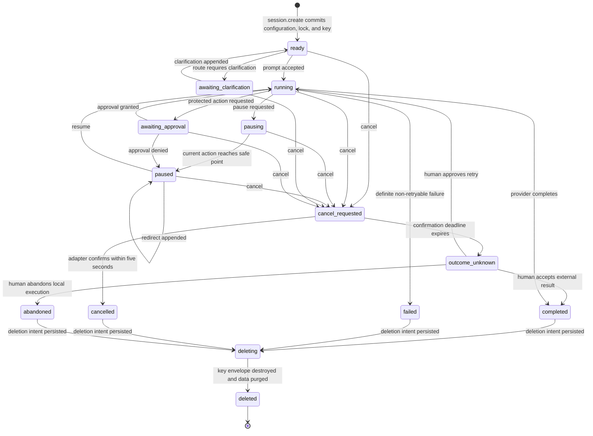

# Session Lifecycle

`session-lifecycle.md` defines the legal state transitions for one durable
Workbench session. State-changing commands are serialized per session and every
accepted transition is persisted before its resulting side effect.

## State Guarantees

| State | Guarantee |
|---|---|
| `ready` | Configuration, lock, and wrapped session key are durable. |
| `running` | At most one current orchestration action owns the session lease. |
| `pausing` | No new action starts; the current action may only reach a safe point. |
| `paused` | New provider and tool actions are prohibited; redirect is append-only. |
| `awaiting_clarification` | No executor has received the unresolved prompt. |
| `awaiting_approval` | The protected side effect has not started. |
| `cancel_requested` | No new work starts while adapter cancellation is pending. |
| `outcome_unknown` | Automation is blocked until explicit human reconciliation. |
| `completed` | A definite successful terminal outcome is durable. |
| `failed` | A definite unsuccessful terminal outcome is durable. |
| `cancelled` | Adapter-confirmed cancellation is durable. |
| `abandoned` | Local automation ended by human decision while the external outcome remains unknown. |
| `deleting` | Encrypted intent and a non-sensitive recovery journal are durable; recovery must finish key destruction before data cleanup. |
| `deleted` | The platform-stored key envelope and in-memory key are destroyed, a non-sensitive tombstone is durable, and payloads are unrecoverable. |

Repeated commands that already produced the current state return the recorded
outcome. Other illegal transitions return `invalid_transition` and append no
state event. Repeating an approval decision is idempotent only when the decision
matches the durable record; a conflicting decision is an illegal transition.
