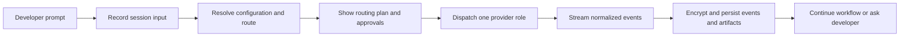

# Multi-Agent Development Workbench — Product Overview

The Workbench gives developers one local, auditable place to route, supervise,
and control software work performed by multiple AI coding providers. This
document stays aligned with the executable specifications under
`doc/arch/specs/features/`.

## Overview

Today each provider keeps separate prompts, permissions, histories, and tool
configuration. The Workbench introduces a provider-independent Rust daemon that
turns those runtimes into configurable roles within durable workflows. VS Code,
terminal, headless, and ACP clients observe the same sessions and can pause,
resume, cancel, or redirect work without losing history.

## Actors

- **Developer** — submits work, reviews routing plans and artifacts, grants
  approvals, and intervenes in active sessions.
- **Workflow author** — maps engineering roles to model aliases, policies,
  fallbacks, tools, and transitions.
- **Local operator** — installs the daemon and provider CLIs, maintains
  configuration, and diagnoses compatibility.
- **Presentation client** — VS Code, terminal, headless CLI, or ACP software
  that displays and controls daemon sessions.
- **Provider runtime** — Claude, Codex, Grok, or an API-backed agent reached
  through an isolated adapter.
- **MCP server** — supplies shared tools through the daemon's policy gateway.

## Main Flow

Explicit targets and active workflow steps route first. Deterministic data
resolvers answer status and history requests without a model. A configured
coordinator handles remaining classification; low confidence requests
clarification. Inputs are never broadcast implicitly.

## Acceptance

The authoritative behavior lives in the Gherkin corpus:

- Every user-visible behavior has a matching feature in
  `doc/arch/specs/features/`.
- Every routing decision is visible before dispatch and retained in history.
- Attached clients observe the same ordered session events and controls.
- Repository configuration cannot widen global tool or production permissions.
- Default tests call only fake providers and consume no paid model quota.
- Main-flow changes start in the corpus, not in product code.
- Run `speckit verify` to check the implementation against the feature corpus.

## Governed Contracts

- [`workbench-local-protocol.yaml`](../contracts/workbench-local-protocol.yaml)
  defines same-user IPC commands, replies, events, errors, framing, and replay.
- [`local-protocol-semantics.md`](../domain/local-protocol-semantics.md)
  fixes command preconditions, event payloads, retry rules, and reconciliation.
- [`workbench-configuration.schema.json`](../datamodels/workbench-configuration.schema.json)
  defines resolved configuration and fixed safety limits.
- [`workbench-lock.schema.json`](../datamodels/workbench-lock.schema.json)
  defines deterministic provider, model, protocol, and MCP pins.
- [`provider-capabilities.schema.json`](../datamodels/provider-capabilities.schema.json)
  defines adapter preflight and retry-relevant operation facts.
- [`session-event.schema.json`](../datamodels/session-event.schema.json)
  defines encrypted persisted event envelopes and side-effect attempts.
- [`session-key-envelope.schema.json`](../datamodels/session-key-envelope.schema.json)
  defines the wrapped session keys held outside SQLite.
- [`session-lifecycle.md`](../statecharts/session-lifecycle.md) defines legal
  controls, cancellation, uncertain-outcome reconciliation, and deletion.
- [`cli-surface.md`](../domain/cli-surface.md) defines the feature 001 headless
  commands and stable exit statuses.

## Observability

- **Metrics** track bounded session states, routing outcomes, policy denials,
  provider lifecycle outcomes, cancellation latency, and replay lag.
- **Logs** record structured decisions and failures without prompt bodies or
  credentials by default.
- **Traces** follow a user input or control through routing, policy, storage,
  and provider boundaries using correlation identifiers.

The complete conventions live in
`doc/arch/observability/observability.md`.
