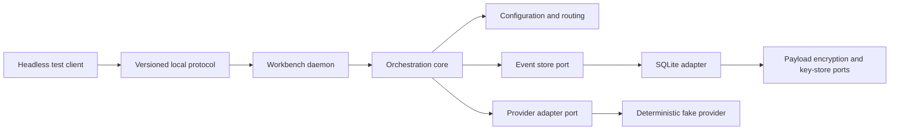

# Implementation Plan: Orchestration Kernel Foundation

## Overview

Deliver one executable vertical slice of the local Workbench control plane. A
headless client will create a session, resolve configuration, route a prompt to
a deterministic fake provider, stream normalized events, replay those events
after reconnect, and exercise pause, resume, redirect, cancel, reconciliation,
encrypted export, and cryptographic deletion. This proves the domain,
protocol, recovery, and encrypted-storage boundaries required by feature 001
without connecting to paid providers or building presentation clients.

## Technical Approach

Use a Rust Cargo workspace with hexagonal boundaries. Domain crates define
behavior and ports; infrastructure crates implement local IPC and SQLite; the
daemon composes them. Dependencies point inward, and no client or provider
adapter can reach storage directly.

### Workspace Boundaries

| Crate | Responsibility |
|---|---|
| `workbench-core` | Sessions, routing plans, state transitions, policy decisions, provider and event-store ports |
| `workbench-config` | YAML schema, four-layer merge, aliases, capability requirements, redaction, and snapshot hashes |
| `workbench-protocol` | Versioned request, response, control, error, and event DTOs with strict size and schema limits |
| `workbench-storage` | SQLite events, envelope encryption, platform key-store adapters, replay, retention, export, and migrations |
| `workbench-daemon` | Application services, local transport, adapter registry, lifecycle, and graceful shutdown |
| `workbench-cli` | Minimal headless commands used to exercise the daemon; no interactive TUI |
| `workbench-testkit` | Fake provider, fake coordinator, fake clock, fixtures, and network-denial test support |

The first implementation pins Rust 1.95.0 and every direct dependency.
Formatting, Clippy with warnings denied, unit tests, contract tests,
cryptographic test vectors, and integration tests form the default gate.

### Configuration Resolution

Each configuration layer parses and validates independently before merging.
Maps merge by key; scalar and sequence values replace lower-precedence values.
An explicit `null` is rejected unless the schema declares a value nullable.
After aliases and capabilities resolve, a schema-driven redactor produces the
session snapshot. Recursively key-sorted, whitespace-free UTF-8 JSON is the
canonical representation hashed with BLAKE3-256. Secret fields accept only
opaque credential references.

The resolved schema includes providers, models, roles, workflows, the central
tool, data-source, and MCP registries, routing, policy, storage, and protocol
limits. Semantic validation rejects every missing cross-reference, requires a
data source to resolve to an idempotent read operation, and rejects an operation
marked idempotent when its effect class is paid inference, non-idempotent
mutation, production access, or credential access.

The non-session layers generate the repository-scope
`.workbench/workbench.lock` without timestamps or environment-dependent paths.
The lock records its configuration hash, protocol version, adapter protocol,
adapter version and executable SHA-256, runtime models, and MCP versions and
checksums. Session creation first verifies that base lock, applies overrides,
and stores a deterministic session-scope lock linked by the base lock hash.
Overrides may remap already pinned components but cannot introduce a new
executable or MCP. Empty adapter or MCP maps are valid for the fake-provider
slice. Repository policy decides whether the local base lock is tracked.

### Routing and Policy

The router is a side-effect-free ordered rule chain. Each rule returns
`NoMatch`, `Selected`, or `NeedsClarification`; the first terminal result wins.
The selected route is joined with role capability requirements and policy
grants before adapter preflight. Policy intersection is monotonic: a
lower-precedence layer can reduce authority but cannot widen it.

Coordinator classification uses the same provider port as other model work but
returns a typed intent candidate. Tests supply a fake result. Multi-stage
workflow execution is represented in types but remains outside this feature.

### Session State and Storage

The event log is append-only until an explicit retention or deletion command.
A SQLite transaction allocates the next session-local sequence and appends an
event before its resulting side effect. Session state is rebuilt by folding
events through the legal transitions in `session-lifecycle.md`. SQLite runs in
WAL mode behind a single storage boundary; non-sensitive deletion tombstones
remain queryable after key destruction. Migrations are forward-only and carry
a schema version. A durable command-outcome index makes `request_id` an
idempotency key and prevents a lost reply from duplicating session creation,
input, controls, or external effects.

Session creation validates configuration and the base lock before writing. It
then creates the platform key envelope and commits the session, configuration,
session lock, creation request outcome, and initial events in one SQLite
transaction that exposes `ready`. A failed transaction deletes the new
envelope; after database integrity and migration checks succeed under the
single-daemon lock, startup removes envelopes left orphaned by a crash before
commit.

Every provider or tool call receives an attempt identifier. The daemon persists
`dispatch_planned` and `dispatch_started` before invocation, then persists
acknowledgement and a definite terminal result when the adapter can prove them.
Recovery of a started attempt without a definite terminal event produces
`outcome_unknown`. Paid inference, mutation, production, credential, and every
operation other than an explicitly idempotent read remain blocked until a
human chooses retry, accept result, or abandon. A new retry uses a new attempt
identifier linked to the uncertain attempt. Abandonment reaches a distinct
terminal state and does not claim external cancellation.

Controls are commands validated against the folded state. Repeated valid
controls return the recorded outcome. Pause prevents new actions and reaches a
safe point after the current action settles. Redirect is valid only while
paused or awaiting input. Cancellation records intent and signals the adapter;
confirmation within five seconds produces `cancelled`, while expiration
produces `outcome_unknown`.

### Encryption, Retention, and Export

Each session receives a random 256-bit data-encryption key. Sensitive payloads
use XChaCha20-Poly1305 with a fresh 192-bit nonce and associated data containing
the storage schema, session, event, sequence, and kind. The session key is
wrapped by a random 256-bit root key held in macOS Keychain or Linux Secret
Service. The wrapped session-key envelope is also held in the platform key
store under `session/<session-id>/v1`; SQLite stores only its identifier.
Persistent session creation fails closed if the key store cannot create,
unlock, or return either key record.

SQLite retains only ordering metadata, key identifiers, nonces, and
ciphertext. The deterministic test profile uses an in-memory key store but the
same encryption implementation. Session history has no automatic expiration
unless `retention_days` is configured. Retention age starts at a terminal
event; active and uncertain sessions are never deleted automatically.
Retention uses the same deletion state machine: first persist intent, then
atomically create a non-sensitive deletion journal, remove the platform-stored
key envelope and evict the in-memory session key, purge rows and artifacts, and
finally convert the journal to a tombstone. The journal contains only session,
deletion, and request identifiers so recovery can finish in that order without
the session key. Portable export emits only an age v1 encrypted bundle for
explicit recipients; no plaintext export command exists and no local key
material enters the bundle. Export streams directly to the encrypted output,
creates no plaintext temporary file, and zeroizes secret-key and plaintext
buffers after their final use.

The decrypted age payload is UTF-8 NDJSON with canonical, key-sorted JSON
records. A version-1 manifest comes first and records the session,
configuration hash, lock hash, and event count; the redacted configuration
snapshot, session lock, and ordered event records follow. The payload contains
no root key, data-encryption key, wrapped key, credential value, or platform
key-store identifier.

### Local Client Protocol

Use a typed, newline-framed JSON request/response and notification protocol
over same-user local IPC. Unix domain sockets are used on Unix platforms and
feature 001 supports macOS and Linux only. Every connection verifies peer
ownership and endpoint permissions before negotiating `workbench/1`. Failure
to verify ownership closes the connection without creating session state.
Actors recorded for controls, approvals, reconciliation, export, and deletion
are derived by the daemon as `local-user:<uid>` from the verified peer
credential; client-supplied labels are never authoritative identities.

Frames have a fixed 8 MiB ceiling. Each subscriber receives a bounded queue of
1,024 events or 8 MiB; crossing either limit emits `client_lagged` and
disconnects only that client. Event delivery is at-least-once. Reconnecting
clients resume after a sequence cursor and deduplicate stable event
identifiers. Unknown methods and incompatible majors return stable errors.

The error taxonomy is closed for protocol v1:

| Category | Meaning |
|---|---|
| `invalid_request`, `unsupported_version`, `frame_too_large` | Invalid protocol input |
| `unauthorized_peer`, `policy_denied`, `approval_required` | Trust or permission refusal |
| `session_not_found`, `invalid_transition`, `client_lagged` | Client/session lifecycle condition |
| `capability_unavailable`, `provider_unavailable`, `provider_timeout` | Provider preflight or execution failure |
| `outcome_unknown` | External side effect lacks a definite result and requires a human |
| `storage_unavailable`, `key_store_unavailable` | Durable or encrypted persistence is unavailable |
| `internal` | Redacted unexpected failure with a correlation identifier |

ACP remains an outer adapter for later editor and terminal features; ACP types
do not enter the core. Provider runtime protocols likewise remain inside
provider adapters. Exact command preconditions, event payloads, retry rules,
and replay behavior are fixed in `local-protocol-semantics.md`.

### Security and Observability

The daemon validates peer ownership before negotiation and creates IPC
endpoints and state files with user-only permissions. Unsupported ownership
verification fails closed. Protocol DTOs never carry raw credential values.
Logs and protocol errors use stable categories and correlation identifiers;
prompt and model-output bodies are excluded by default.

Structured tracing spans cover configuration, routing, policy, persistence,
adapter calls, controls, and replay. Metrics use bounded outcome and adapter
labels. Export is opt-in; tests inspect an in-memory telemetry sink.

## Verification Strategy

- Unit tests cover merge precedence, redaction, routing order, policy
  intersection, state transitions, and error normalization.
- Property tests cover event-fold determinism, idempotent controls, monotonic
  policy reduction, per-session sequence ordering, lock determinism, and
  event replay and command-request deduplication.
- Contract tests run every provider-port behavior against the fake adapter and
  every client message and error against the committed AsyncAPI fixtures.
- SQLite integration tests cover atomic append, migration, uncertain-attempt
  recovery, encrypted WAL contents, retention, every deletion crash point,
  cryptographic deletion, tombstones, and replay from concurrent readers.
- Cryptographic tests use published XChaCha20-Poly1305 and age fixtures, assert
  fresh nonces, reject modified associated data, and verify key rotation.
- End-to-end tests start the daemon on a temporary local endpoint, execute the
  twenty-three acceptance scenarios, inspect storage for plaintext leaks, and
  assert that network access remains unused.
- Platform tests cover peer ownership and endpoint permissions on macOS and
  Linux. Windows remains unsupported until a later feature supplies and tests
  a named-pipe transport.
- The implementation gate fails when any feature 001 Gherkin scenario remains
  unbound, even if the underlying Speckit verifier reports unbound scenarios as
  advisory before implementation.

## Delivery Sequence

1. Pin Rust 1.95.0, workspace dependencies, lint policy, and the unbound-scenario
   implementation gate.
2. Generate contract fixtures from the committed AsyncAPI, JSON Schemas, CUE,
   and statechart; fail CI on generated drift.
3. Implement domain identifiers, attempts, events, state folding, controls, and
   ports.
4. Implement configuration merge, lock generation, alias resolution,
   redaction, capability preflight, and policy intersection.
5. Implement envelope encryption, key-store ports, SQLite persistence,
   retention, encrypted export, deletion, and migrations.
6. Implement protocol DTOs, same-user Unix IPC, bounded streaming, daemon
   composition, approval resolution, and reconciliation methods.
7. Add the headless CLI, deterministic fake provider, in-memory key store, fake
   clock, and network-denial testkit.
8. Bind all twenty-three Gherkin scenarios, run every gate, and update operator
   documentation.

## Risks and Mitigations

- **Too many crate boundaries:** keep DTO conversion at crate edges and merge a
  crate before release if it contains no independent policy or test surface.
- **Protocol churn:** version fixtures from the first commit and reject unknown
  major versions.
- **Sensitive event payloads:** use explicit persisted event DTOs and
  envelope encryption rather than serializing internal objects or trusting
  filesystem permissions alone.
- **Cancellation and crash races:** serialize commands per session, persist
  attempt facts before effects, and surface uncertainty instead of retrying.
- **Key loss:** fail closed, expose health diagnostics, test root-key rotation,
  and document that unrecoverable root keys make history unrecoverable.
- **Slow clients:** bound every subscriber and rely on cursor replay rather than
  allowing one client to backpressure orchestration.
- **Platform IPC differences:** keep transport behind a contract suite and do
  not claim support for an untested platform.

## Companion Artifacts

- `doc/arch/functional/product-overview.md` remains the cross-feature product
  entry point.
- `doc/arch/runbooks/deploy.md` governs publication while the repository
  contains specifications only.
- `workbench-local-protocol.yaml` defines the AsyncAPI protocol and closed error
  taxonomy.
- `local-protocol-semantics.md` defines command preconditions, event payloads,
  recovery, retry, and backpressure behavior.
- `cli-surface.md` defines the minimal headless command and output contract.
- The five JSON Schemas define configuration, lock, provider capabilities,
  platform-stored session-key envelopes, and encrypted persisted events.
- The feature CUE schema defines routing-plan value objects.
- `session-lifecycle.md` defines every legal session transition.
- The twenty-three-scenario Gherkin feature is the behavioral acceptance contract.
- Generated implementation fixtures must remain byte-consistent with these
  committed artifacts.
- A quickstart will be written once executable commands exist.
