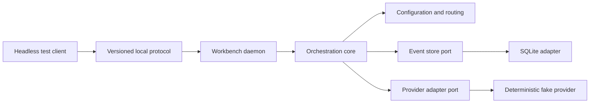

# Implementation Plan: Orchestration Kernel Foundation

## Overview

Deliver one executable vertical slice of the local Workbench control plane. A
headless client will create a session, resolve configuration, route a prompt to
a deterministic fake provider, stream normalized events, replay those events
after reconnect, and exercise pause, resume, redirect, and cancel. This proves
the domain and protocol boundaries required by feature 001 without connecting
to paid providers or building presentation clients.

## Technical Approach

Use a Rust Cargo workspace with hexagonal boundaries. Domain crates define
behavior and ports; infrastructure crates implement local IPC and SQLite; the
daemon composes them. Dependencies point inward, and no client or provider
adapter can reach storage directly.

### Workspace Boundaries

| Crate | Responsibility |
|---|---|
| `workbench-core` | Sessions, routing plans, state transitions, policy decisions, provider and event-store ports |
| `workbench-config` | YAML schema, four-layer merge, aliases, capability requirements, redaction, and snapshot hashes |
| `workbench-protocol` | Versioned request, response, control, error, and event DTOs with strict size and schema limits |
| `workbench-storage` | SQLite event store, per-session sequence allocation, replay cursors, and migrations |
| `workbench-daemon` | Application services, local transport, adapter registry, lifecycle, and graceful shutdown |
| `workbench-cli` | Minimal headless commands used to exercise the daemon; no interactive TUI |
| `workbench-testkit` | Fake provider, fake coordinator, fake clock, fixtures, and network-denial test support |

The first implementation will pin the Rust toolchain and every direct
dependency. Formatting, Clippy with warnings denied, unit tests, contract
tests, and integration tests form the default gate.

### Configuration Resolution

Each configuration layer parses and validates independently before merging.
Maps merge by key; scalar and sequence values replace lower-precedence values.
An explicit `null` is rejected unless the schema declares a value nullable.
After aliases and capabilities resolve, a schema-driven redactor produces the
session snapshot and a canonical encoding produces its content hash. Secret
fields accept only opaque credential references.

### Routing and Policy

The router is a side-effect-free ordered rule chain. Each rule returns
`NoMatch`, `Selected`, or `NeedsClarification`; the first terminal result wins.
The selected route is joined with role capability requirements and policy
grants before adapter preflight. Policy intersection is monotonic: a
lower-precedence layer can reduce authority but cannot widen it.

Coordinator classification uses the same provider port as other model work but
returns a typed intent candidate. Tests supply a fake result. Multi-stage
workflow execution is represented in types but remains outside this feature.

### Session State and Storage

The event log is append-only. A SQLite transaction allocates the next
session-local sequence and appends the event before side effects occur. Session
state is rebuilt by folding events, which makes replay and recovery testable.
SQLite runs in WAL mode behind a single storage boundary; migrations are
forward-only and carry a schema version.

Controls are commands validated against the folded state. Repeated valid
controls return the existing outcome. Cancellation first records intent, then
signals the adapter, and finally records a terminal result; a daemon-owned
deadline handles an unresponsive adapter.

### Local Client Protocol

Use a typed, newline-framed JSON request/response and notification protocol
over same-user local IPC. Unix domain sockets are used on Unix platforms and
named pipes on Windows behind one transport port. Every connection negotiates
the `workbench/1` major version before other methods. Frames have a configured
hard byte limit, unknown methods return stable errors, and event subscriptions
resume after a session sequence cursor.

ACP remains an outer adapter for later editor and terminal features; ACP types
do not enter the core. Provider runtime protocols likewise remain inside
provider adapters.

### Security and Observability

The daemon validates peer ownership where the platform exposes it and creates
IPC endpoints and state files with user-only permissions. Protocol DTOs never
carry raw credential values. Logs and protocol errors use stable categories and
correlation identifiers; prompt and model-output bodies are excluded by
default.

Structured tracing spans cover configuration, routing, policy, persistence,
adapter calls, controls, and replay. Metrics use bounded outcome and adapter
labels. Export is opt-in; tests inspect an in-memory telemetry sink.

## Verification Strategy

- Unit tests cover merge precedence, redaction, routing order, policy
  intersection, state transitions, and error normalization.
- Property tests cover event-fold determinism, idempotent controls, monotonic
  policy reduction, and per-session sequence ordering.
- Contract tests run every provider-port behavior against the fake adapter and
  every client message against protocol fixtures.
- SQLite integration tests cover atomic append, migration, recovery, and replay
  from concurrent readers.
- End-to-end tests start the daemon on a temporary local endpoint, execute the
  nine acceptance scenarios, and assert that network access remains unused.
- Platform tests cover Unix IPC initially; the Windows named-pipe adapter must
  pass the same transport contract before Windows support is declared.

## Delivery Sequence

1. Pin the workspace toolchain, lint policy, dependency policy, and test gate.
2. Implement domain identifiers, events, state folding, commands, and ports.
3. Implement configuration parsing, merge, alias resolution, redaction, and
   capability preflight.
4. Implement deterministic routing and monotonic policy resolution.
5. Implement SQLite persistence and migrations.
6. Implement protocol DTOs, local IPC, daemon composition, and control methods.
7. Add the headless CLI and deterministic testkit.
8. Bind Gherkin scenarios, run all gates, and update operator documentation.

## Risks and Mitigations

- **Too many crate boundaries:** keep DTO conversion at crate edges and merge a
  crate before release if it contains no independent policy or test surface.
- **Protocol churn:** version fixtures from the first commit and reject unknown
  major versions.
- **Sensitive event payloads:** use explicit persisted event DTOs and
  schema-driven redaction rather than serializing internal objects.
- **Cancellation races:** serialize state-changing commands per session and
  test every terminal transition with a controlled fake clock.
- **Platform IPC differences:** keep transport behind a contract suite and do
  not claim support for an untested platform.

## Companion Artifacts

- The feature CUE schema defines the routing-plan value objects.
- The Gherkin feature is the behavioral acceptance contract.
- Protocol fixtures and a storage migration manifest will be added during
  implementation alongside their owning crates.
- A quickstart will be written once executable commands exist.
