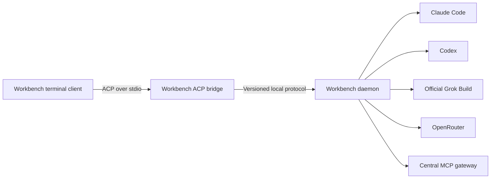

# Grok Build Terminal Integration

## Status

Accepted architecture for specification. Implementation remains gated by the
project's Speckit workflow.

## Decision

The Workbench terminal UI will be derived from the
[Grok Build fork](https://github.com/RenatoTadeuFigueiredo/grok-build), while
workflow orchestration remains in the provider-independent Rust daemon.
Grok Build is a presentation dependency, not the Workbench control plane.

Two distinct executables remain involved:

- `workbench` is the multi-provider terminal client and headless CLI.
- `grok` is the unmodified official provider runtime authenticated with the
  user's Grok subscription.

The terminal client connects to `workbench agent stdio`, a narrow ACP bridge
that forwards prompts and session controls to `workbench daemon`.
Provider selection, role routing, and model changes follow
[`configuration-routing-and-providers.md`](configuration-routing-and-providers.md)
and are never implemented in the terminal fork.



## Upstream Branch Model

The fork uses an upstream-first patch-stack workflow:

```text
xai-org/grok-build:main
          |
          v
origin/main                 # exact, fast-forward-only mirror
          |
          v  rebase
origin/workbench            # reviewed downstream integration stack
          |
          +-- feature/*
```

`main` must never contain Workbench changes. Feature branches start from
`workbench` and merge back through pull requests. Upstream updates are replayed
on a temporary `sync/grok-build-<sha>` branch, reviewed with `git range-diff`,
and promoted only after compatibility tests pass. Release tags are immutable;
only the downstream integration branch may be rewritten with
`--force-with-lease`.

## Patch Boundary

The downstream patch should add a selectable external ACP backend without
redesigning the pager:

```text
AgentBackend
|-- GrokShellBackend        # unchanged upstream behavior
`-- WorkbenchBackend        # launches workbench agent stdio
```

New code belongs in isolated Workbench crates or modules. Runtime branding,
feature visibility, and unsupported commands should be capability-driven.
Avoid modifications to rendering, scrollback, input widgets, diffs, permission
views, or the Grok agent runtime.

The initial spike passes only if:

- no more than five to eight upstream files require modification;
- no pager rendering or widget implementation is forked;
- prompt, streaming, permission, cancellation, and session load work over ACP;
- the original Grok pager tests remain green;
- PTY and snapshot tests cover the Workbench backend; and
- the patch stack rebases across two consecutive upstream snapshots without
  material manual reconstruction.

If these gates fail, the terminal client must fall back to a smaller
first-party Ratatui implementation rather than allowing an unbounded fork.

## Protocol and Capability Mapping

Core behavior must use standard ACP messages such as `initialize`,
`session/new`, `session/load`, `session/prompt`, `session/cancel`, and
`session/update`. Workflow stages should initially render through standard
plan, message, tool-call, and permission events. Grok-specific `x.ai/*`
extensions are optional enhancements and cannot be required for correctness.

Unknown metadata and events must be ignored safely. Unsupported pager actions
must be hidden or return an explicit capability error. The bridge must not
impersonate the Grok provider or access Grok authentication state.

## Update and Compatibility Policy

The Workbench repository pins the tested fork commit in a lock or compatibility
manifest. An automated upstream-sync job:

1. fetches `xai-org/grok-build:main`;
2. fast-forwards the fork's mirror branch;
3. rebases the downstream patch stack onto a temporary sync branch;
4. builds both the original pager and Workbench terminal client;
5. runs upstream tests, ACP contract tests, PTY tests, and snapshots; and
6. opens a pull request for human review.

The official `grok` provider updates independently. Workbench launches it as
`grok --no-auto-update agent stdio`, preventing a provider update during an
active workflow. An explicit provider update records the previous version,
runs the official updater, executes compatibility tests, and restores the
previous version with `grok update --version <version>` on failure.

Compatibility is capability-first and version-second. Version and commit
identifiers support diagnostics and known-bad rules, but successful ACP
negotiation determines whether the runtime is usable.

## Shared MCP and Tooling

MCP installations belong to the Workbench daemon, not the terminal fork. A
canonical manifest and lockfile pin server packages, images, checksums, and
policy. Claude, Codex, Grok, and API-backed agents connect to the same MCP
gateway with role-specific allowlists. Provider-native tools remain native;
capabilities that must behave identically across providers are exposed through
the gateway.

Secrets stay in the operating-system keychain or provider-owned credential
stores. Neither the fork nor version-controlled configuration may contain
provider sessions, OAuth tokens, or API keys.

## Verified Baseline

On July 23, 2026, the fork's `main` matched `xai-org/grok-build:main` with no
divergent commits. The locally installed Grok Build 0.2.111 successfully
completed an ACP v1 `initialize` handshake when launched with
`--no-auto-update`; it advertised session, prompt, authentication, and MCP
capabilities without invoking a model. The source inspection also confirmed
that the pager currently spawns only the in-process GrokShell backend, so the
external backend remains the critical implementation spike.

## Licensing and Attribution

The Grok Build source is Apache-2.0 licensed. Modified files must carry the
required change notices, and distributed source or binaries must preserve
applicable license, copyright, and third-party notices. Workbench branding must
not imply that the downstream terminal client is an official Grok Build
release.
